# TF4DGS: full-recording continuous 4C4D training

Yogurt: all 467 synchronized frames/camera (15.58 s). Textile: all 1277 frames/camera (42.61 s). Fresh whole-scene action-frame initialization, one joint model per capture, hands and surroundings included. Selected recipe comes from eight brief matched hypotheses. Native 4K refinement is queued; final quality and playback are pending.

## Chronological record

### 001 - textile full-recording cloud initialized

2026-10-09T18:44:15.169000+00:00 / initialized

{"dataset": "textile", "points": 120000, "source_frame": 588, "source_cloud_sha256": "be4aad8735982430359283bb2d83765bbf6300e3d23108ac6d829e40b430ca06", "initial_points_sha256": "9071c682d13dbf6be206b96be58c4b1ec187894698d90be817a4bf755fa2ca58", "initial_temporal_sigma_s": 1.328060400316525, "policy": "One fresh whole-scene action-frame cloud, uniform temporal centers across the full timeline. Every primitive is trainable; no separately trained background or old scene. Multi-time injection rejected by the brief trials.", "claim_limit": "Metric matching plus labelled inferred depths, not independently verified room geometry."}

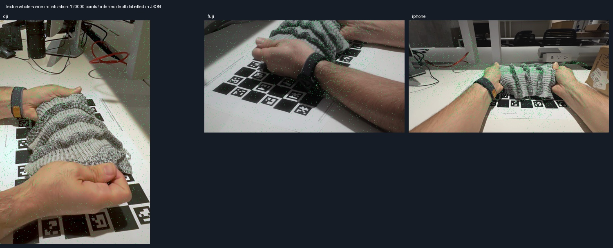

[Stage screenshot](001_headless.png)
[Stage screenshot](001_visible.png)

### 002 - yogurt full-recording cloud initialized

2026-10-09T18:44:33.205914+00:00 / initialized

{"dataset": "yogurt", "points": 120000, "source_frame": 330, "source_cloud_sha256": "edd84f43da97116cefc7c19aafcdcd6783d9d76a8d6eae2b90cd21f4730e5cdf", "initial_points_sha256": "c2236a8035088b2c7ba0c34633525624b8557f19ff9d16fbb0cf5a4ea181153f", "initial_temporal_sigma_s": 1.328060400316525, "policy": "One fresh whole-scene action-frame cloud, uniform temporal centers across the full timeline. Every primitive is trainable; no separately trained background or old scene. Multi-time injection rejected by the brief trials.", "claim_limit": "Metric matching plus labelled inferred depths, not independently verified room geometry."}

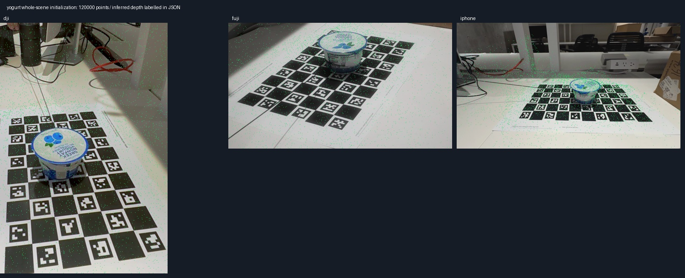

[Stage screenshot](002_headless.png)
[Stage screenshot](002_visible.png)

### 003 - textile: whole_1280 begins

2026-10-09T18:44:36.842342+00:00 / training running

100 updates at edge 1280; validation-selected training. Complete recording, all three cameras, subject/hands and visible surroundings in one continuous model. Checkpoints are resumable.

[Stage screenshot](003_headless.png)
[Stage screenshot](003_visible.png)

### 004 - textile: whole_1280 completed

2026-10-09T18:45:01.395865+00:00 / checkpoint ready

Common 1280 appearance PSNR 10.022 dB / motion 10.462 dB / 120000 Gaussians. Evaluation role: validation. Visual geometry and time playback still require review.

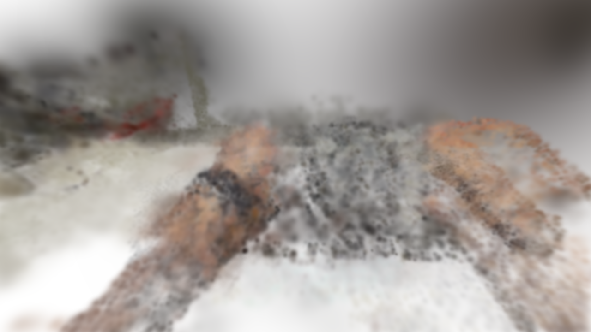
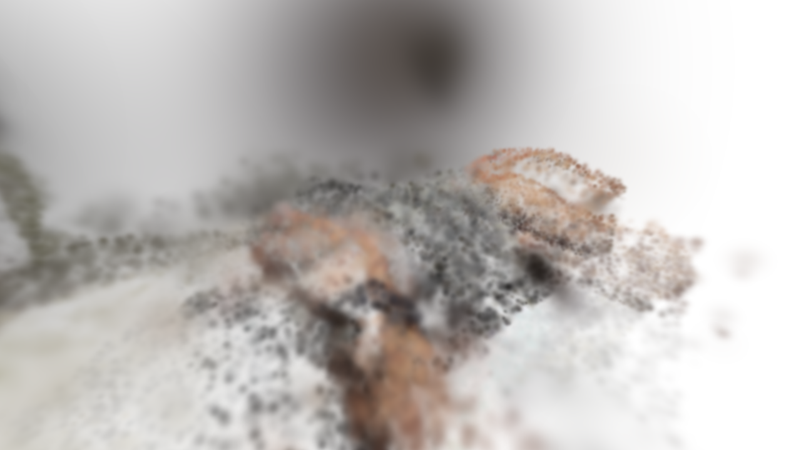

[Stage screenshot](004_headless.png)
[Stage screenshot](004_visible.png)

### 005 - yogurt: whole_1280 begins

2026-10-09T18:45:05.089453+00:00 / training running

100 updates at edge 1280; validation-selected training. Complete recording, all three cameras, subject/hands and visible surroundings in one continuous model. Checkpoints are resumable.

[Stage screenshot](005_headless.png)
[Stage screenshot](005_visible.png)

### 006 - yogurt: whole_1280 completed

2026-10-09T18:45:25.040575+00:00 / checkpoint ready

Common 1280 appearance PSNR 14.836 dB / motion 15.158 dB / 120000 Gaussians. Evaluation role: validation. Visual geometry and time playback still require review.

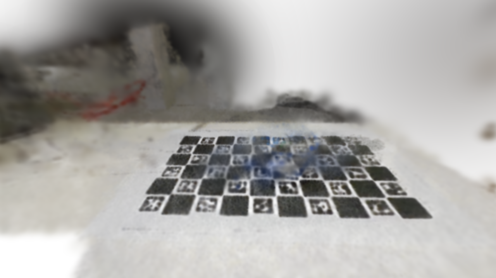
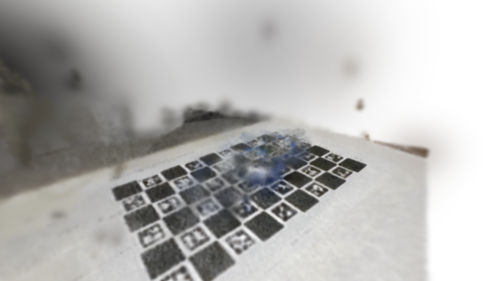

[Stage screenshot](006_headless.png)
[Stage screenshot](006_visible.png)

### 007 - textile: whole_1280 begins

2026-10-09T18:46:45.123625+00:00 / training running

60000 updates at edge 1280; validation-selected training. Complete recording, all three cameras, subject/hands and visible surroundings in one continuous model. Checkpoints are resumable.

[Stage screenshot](007_headless.png)
[Stage screenshot](007_visible.png)

### 008 - textile_whole_1280 checkpoint 1000 updates

2026-10-09T18:47:59.609484+00:00 / checkpoint; training continues

Joint full-frame model at edge 1280; 279081 Gaussians. Validation whole-frame PSNR 16.24 dB, motion-priority PSNR 15.93 dB. Every primitive remains trainable. Camera-view scores do not verify novel-view geometry.

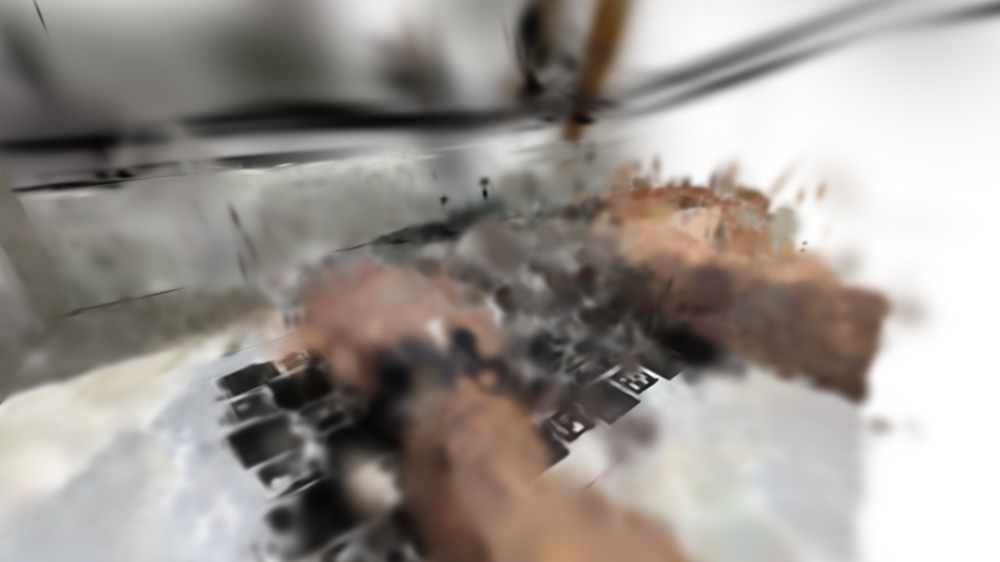

[Stage screenshot](textile_whole_1280_step_001000_checkpoint.png)
[Stage screenshot](long_training_running_visible.png)

### 009 - textile_whole_1280 checkpoint 10000 updates

2026-10-09T19:03:21.760806+00:00 / checkpoint; training continues

Joint full-frame model at edge 1280; 600000 Gaussians. Validation whole-frame PSNR 20.56 dB, motion-priority PSNR 19.70 dB. Every primitive remains trainable. Camera-view scores do not verify novel-view geometry.

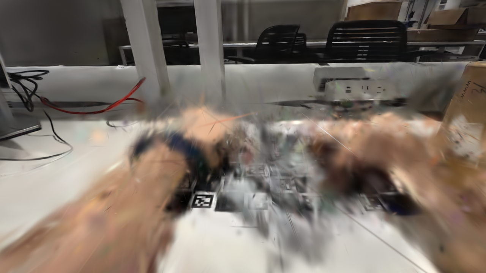
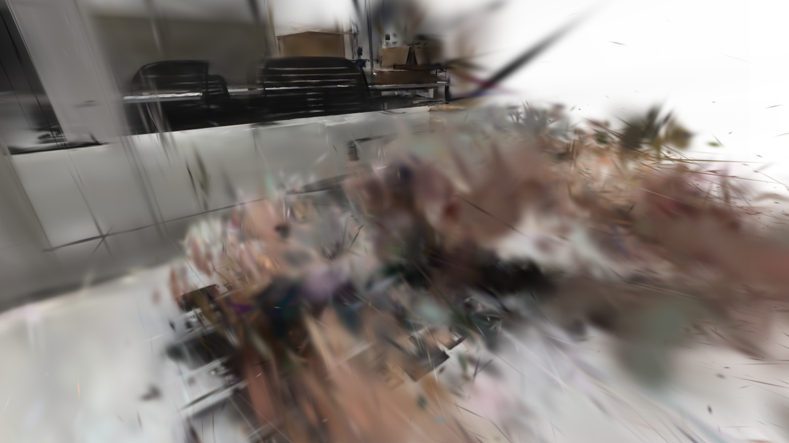

[Stage screenshot](textile_whole_1280_step_010000_checkpoint.png)

### 010 - textile_whole_1280 checkpoint 20000 updates

2026-10-09T19:19:39.448862+00:00 / checkpoint; training continues

Joint full-frame model at edge 1280; 600000 Gaussians. Validation whole-frame PSNR 16.00 dB, motion-priority PSNR 17.95 dB. Every primitive remains trainable. Camera-view scores do not verify novel-view geometry.

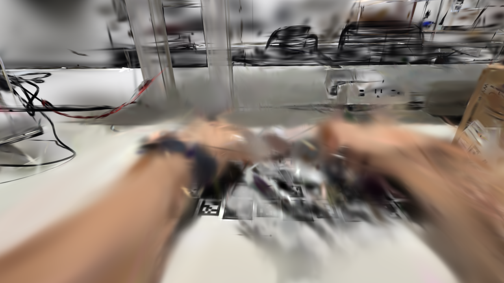
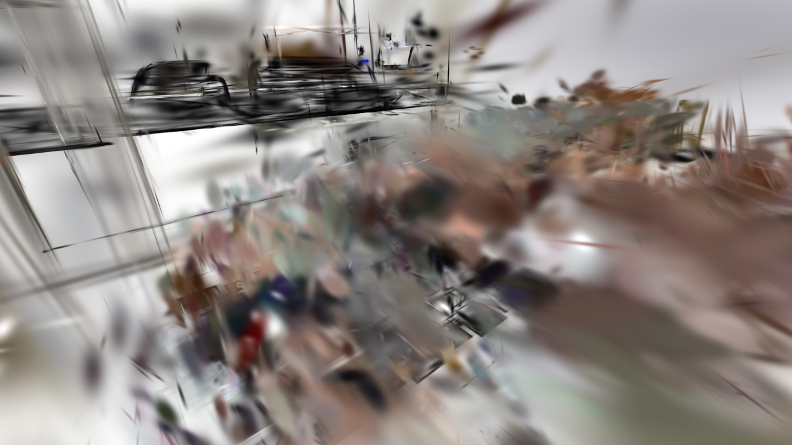

