# TF4DGS: eight improvement hypotheses and full-recording training

Matched 600-update action-clip trials from immutable 10k checkpoints. Textile first, yogurt confirmation. Every visible surface and the hands stay in one jointly trained 4C4D model. Full duration training follows selection; no separate base or old room is merged.

[Finished video comparison](comparison.html)

## Chronological record

### 001 - textile_seed_000072 failed

2026-10-09T05:37:56.438696+00:00 / failed; prior artifacts retained

["C:\\Users\\mnijat\\miniconda3\\envs\\tf4dgs-dynamic\\python.exe", "scripts/Initialize-4C4DScene.py", "--dataset", "textile", "--config", "configs/4c4d_hypotheses_001.json", "--frame", "72", "--label", "seed_000072", "--max-points", "30000"]
Warning, cannot find cuda-compiled version of RoPE2D, using a slow pytorch version instead
Traceback (most recent call last):
  File "C:\Users\mnijat\Desktop\Git\TF4DGS\scripts\Initialize-4C4DScene.py", line 237, in <module>
    main()
  File "C:\Users\mnijat\Desktop\Git\TF4DGS\scripts\Initialize-4C4DScene.py", line 172, in main
    _, inlier = cv2.findFundamentalMat(xy1, xy2, cv2.USAC_MAGSAC, 1., .999)
cv2.error: OpenCV(4.10.0) D:\a\opencv-python\opencv-python\opencv\modules\calib3d\src\usac\sampler.cpp:45: error: (-215:Assertion failed) sample_size <= points_size_ in function 'cv::usac::UniformSamplerImpl::setPointsSize'

Full ignored log: .local\workflows\4c4d_hypotheses_001\textile_seed_000072_20261009_053753.log

[Stage screenshot](001_headless.png)
[Stage screenshot](001_visible.png)

### 002 - textile multi-time geometry prepared

2026-10-09T05:39:40.624138+00:00 / prepared

{"sources": [{"frame": 18, "source_frame": 605, "points": 13462, "motion_priority_points": 7500, "sha256": "9f27462c99263acdd531a14eb315bb3ecb7b12965c282161990a40ed5e80956b"}, {"frame": 42, "source_frame": 629, "points": 13366, "motion_priority_points": 7500, "sha256": "3c19afc00b1b2b90985014834cdd470483fbd73af572d7c378e3443cbf3077a3"}, {"frame": 72, "source_frame": 659, "points": 13493, "motion_priority_points": 7500, "sha256": "3fd162d9c25d844abc044d415943f0e6d51315f87a959241051ea04a342bca6f"}], "points": 40321, "initial_points_sha256": "6e026b7b81f89bfa5aadd38ed0b2f9c3ae9a260007d7ae16f46d3265f9bf2cbe", "scope": "One timestamped cloud to inject into the joint trainable model. Source timestamps are training-only. No pretrained base or old scene. Motion weighting also seeds the rest of the room."}

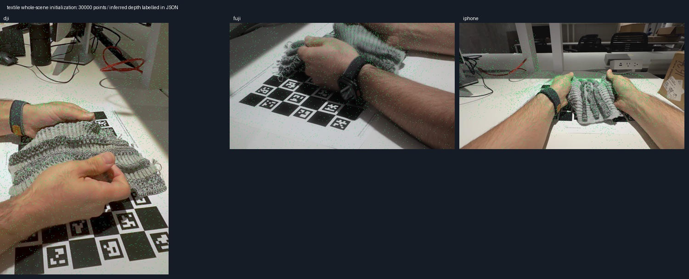
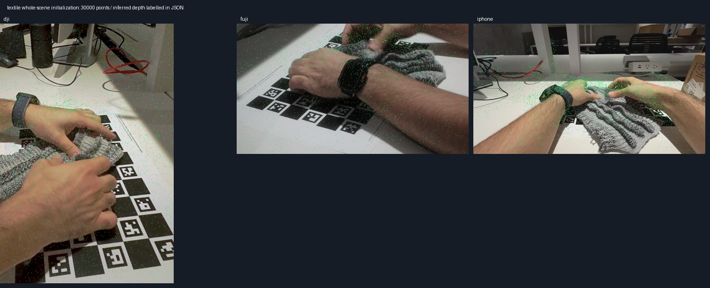
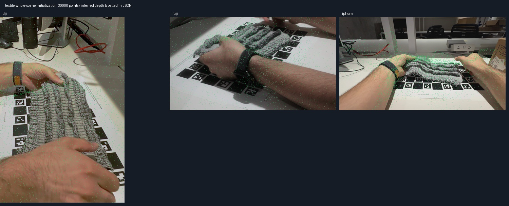

[Stage screenshot](002_headless.png)
[Stage screenshot](002_visible.png)

### 003 - yogurt multi-time geometry prepared

2026-10-09T05:40:40.574787+00:00 / prepared

{"sources": [{"frame": 18, "source_frame": 348, "points": 15000, "motion_priority_points": 7500, "sha256": "91c2ec4cc10134221052aaad5838cd24a1e2eba3376c05b99316a0674b82ee87"}, {"frame": 42, "source_frame": 372, "points": 15000, "motion_priority_points": 7500, "sha256": "edde632ce611c85d9ea568bee2d5347b3ee4a7c6d3d61aa74c9eb19a8ce40fcc"}, {"frame": 72, "source_frame": 402, "points": 15000, "motion_priority_points": 7500, "sha256": "36e19a724548e79c55d6de13708185b37d7cad7de4214ac4d89ea15ebb65bdf6"}], "points": 45000, "initial_points_sha256": "dd5dfe18b56f99a12e3366b897555dc85da2f797df5c12f0de15dcd98d126f7a", "scope": "One timestamped cloud to inject into the joint trainable model. Source timestamps are training-only. No pretrained base or old scene. Motion weighting also seeds the rest of the room."}

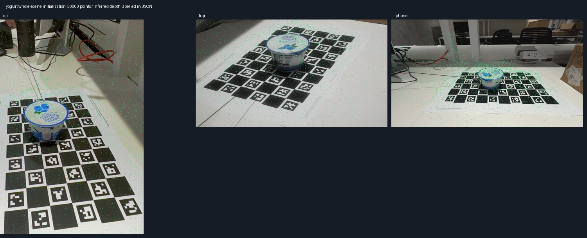
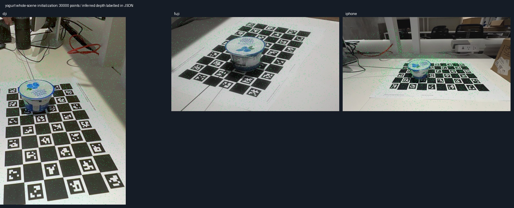
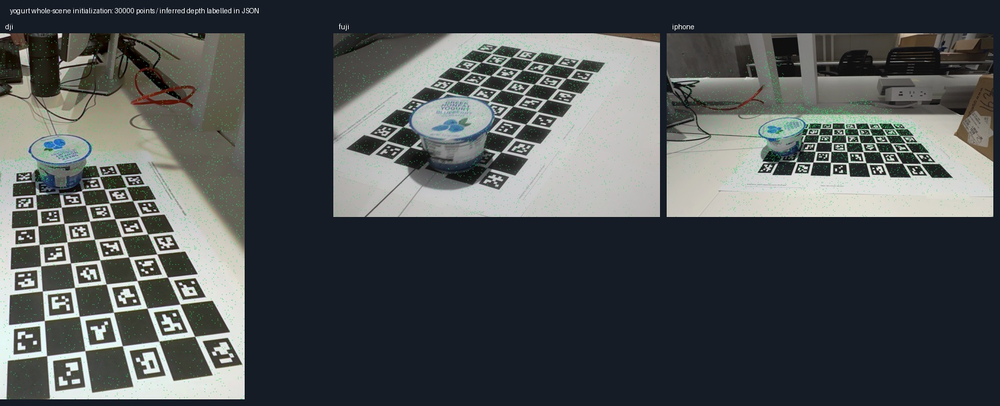

[Stage screenshot](003_headless.png)
[Stage screenshot](003_visible.png)

### 004 - textile: control begins

2026-10-09T05:40:44.493141+00:00 / short trial running

600 optimizer updates from the immutable 10k whole-scene parent, edge 1280; preset baseline. Same checkpoint/RNG, full pixels and three held-out times.

[Stage screenshot](004_headless.png)
[Stage screenshot](004_visible.png)

### 005 - textile: control finished

2026-10-09T05:41:57.357355+00:00 / screen completed; review pending

Nine validation camera images. Common whole-frame 24.2999 dB; motion 23.4285 dB; SSIM 0.84292. 450000 Gaussians; current-run elapsed 60.2s; peak allocated 1.92 GiB. Orbit checked separately; scores do not certify metric geometry.

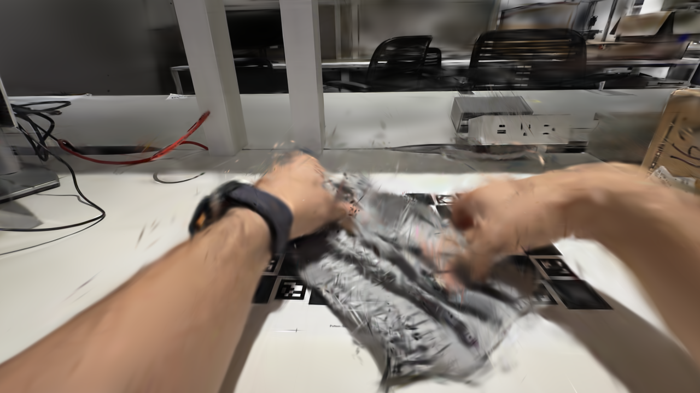
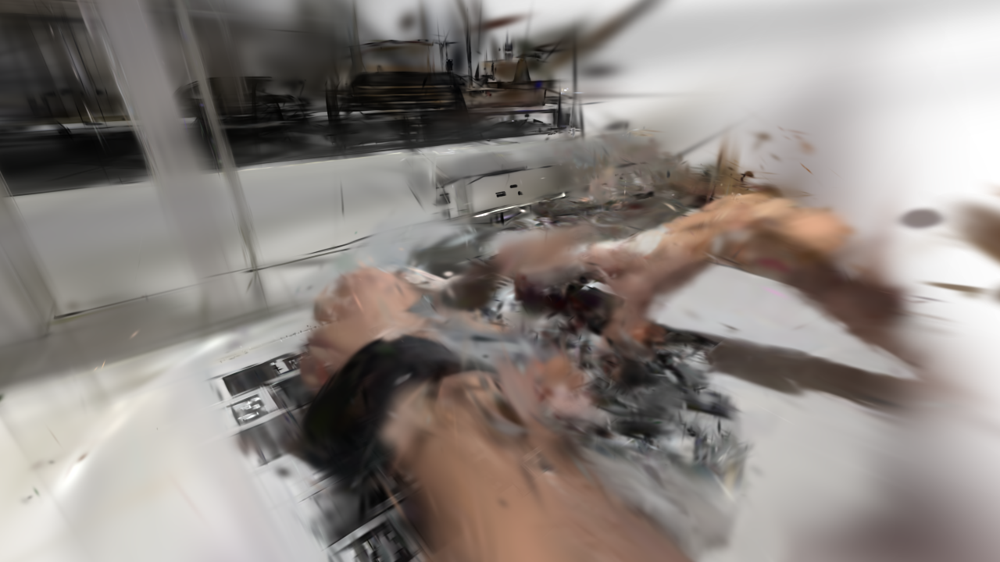

[Stage screenshot](005_headless.png)
[Stage screenshot](005_visible.png)

### 006 - textile: temporal_support begins

2026-10-09T05:42:01.312357+00:00 / short trial running

600 optimizer updates from the immutable 10k whole-scene parent, edge 1280; preset baseline. Same checkpoint/RNG, full pixels and three held-out times.

[Stage screenshot](006_headless.png)
[Stage screenshot](006_visible.png)

### 007 - textile: temporal_support finished

2026-10-09T05:43:10.604995+00:00 / screen completed; review pending

Nine validation camera images. Common whole-frame 24.3770 dB; motion 23.5391 dB; SSIM 0.84433. 450000 Gaussians; current-run elapsed 58.3s; peak allocated 1.93 GiB. Orbit checked separately; scores do not certify metric geometry.

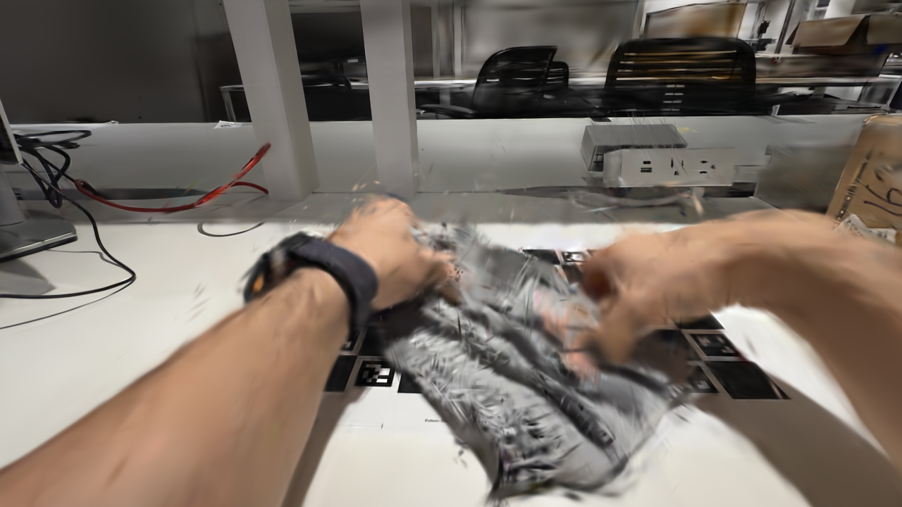
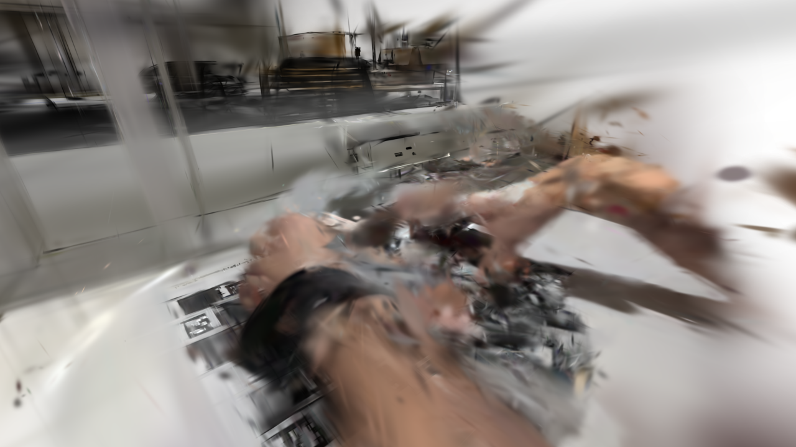

[Stage screenshot](007_headless.png)
[Stage screenshot](007_visible.png)

### 008 - textile: compact_geometry begins

2026-10-09T05:43:14.493964+00:00 / short trial running

600 optimizer updates from the immutable 10k whole-scene parent, edge 1280; preset baseline. Same checkpoint/RNG, full pixels and three held-out times.

[Stage screenshot](008_headless.png)
[Stage screenshot](008_visible.png)

### 009 - textile: compact_geometry finished

2026-10-09T05:44:28.662512+00:00 / screen completed; review pending

Nine validation camera images. Common whole-frame 23.6027 dB; motion 23.3943 dB; SSIM 0.83326. 450000 Gaussians; current-run elapsed 63.9s; peak allocated 3.74 GiB. Orbit checked separately; scores do not certify metric geometry.

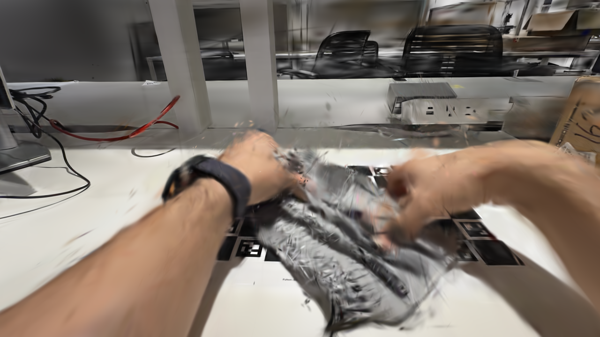
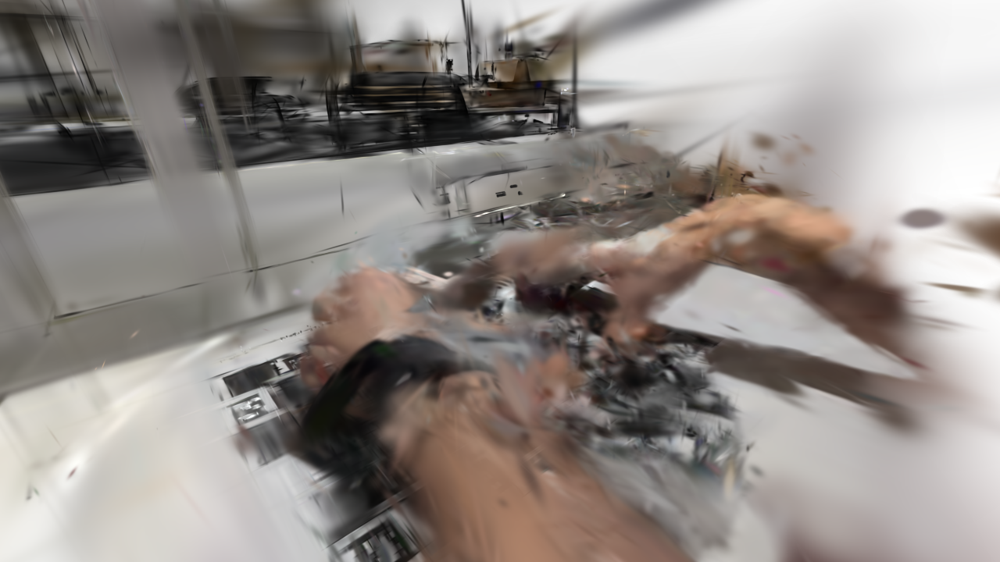

[Stage screenshot](009_headless.png)
[Stage screenshot](009_visible.png)

### 010 - textile: pattern_detail begins

2026-10-09T05:44:33.010921+00:00 / short trial running

600 optimizer updates from the immutable 10k whole-scene parent, edge 1280; preset baseline. Same checkpoint/RNG, full pixels and three held-out times.

[Stage screenshot](010_headless.png)
[Stage screenshot](010_visible.png)

### 011 - textile: pattern_detail finished

2026-10-09T05:45:51.588602+00:00 / screen completed; review pending

Nine validation camera images. Common whole-frame 24.0004 dB; motion 23.3608 dB; SSIM 0.83797. 450000 Gaussians; current-run elapsed 61.2s; peak allocated 2.28 GiB. Orbit checked separately; scores do not certify metric geometry.

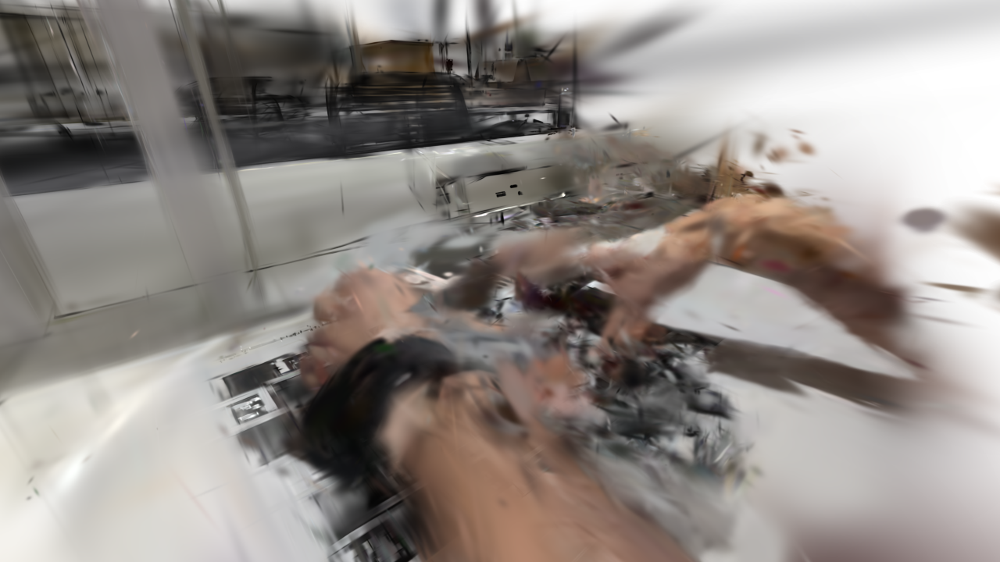

[Stage screenshot](011_headless.png)
[Stage screenshot](011_visible.png)

### 012 - textile: motion_priority begins

2026-10-09T05:45:55.900950+00:00 / short trial running

600 optimizer updates from the immutable 10k whole-scene parent, edge 1280; preset baseline. Same checkpoint/RNG, full pixels and three held-out times.

[Stage screenshot](012_headless.png)
[Stage screenshot](012_visible.png)

### 013 - textile: motion_priority finished

2026-10-09T05:47:12.887236+00:00 / screen completed; review pending

Nine validation camera images. Common whole-frame 24.8461 dB; motion 23.5739 dB; SSIM 0.84915. 450000 Gaussians; current-run elapsed 65.4s; peak allocated 1.94 GiB. Orbit checked separately; scores do not certify metric geometry.

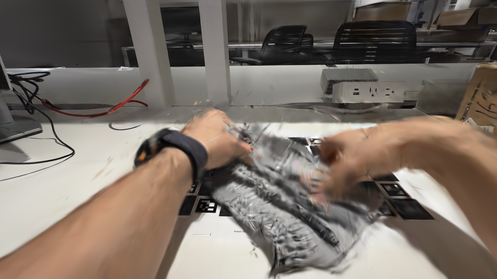
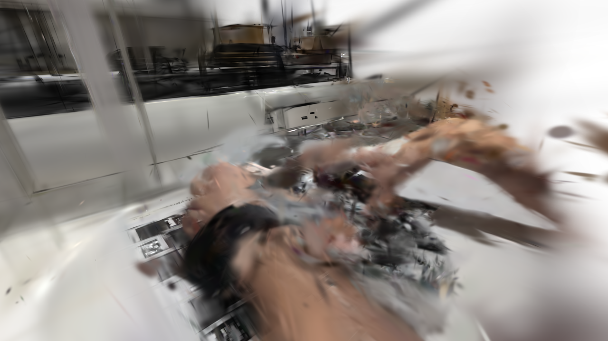

[Stage screenshot](013_headless.png)
[Stage screenshot](013_visible.png)

### 014 - textile: point_capacity begins

2026-10-09T05:47:17.433066+00:00 / short trial running

600 optimizer updates from the immutable 10k whole-scene parent, edge 1280; preset baseline. Same checkpoint/RNG, full pixels and three held-out times.

[Stage screenshot](014_headless.png)
[Stage screenshot](014_visible.png)

### 015 - textile: point_capacity finished

2026-10-09T05:48:33.579134+00:00 / screen completed; review pending

Nine validation camera images. Common whole-frame 26.1094 dB; motion 24.2090 dB; SSIM 0.86791. 599881 Gaussians; current-run elapsed 64.2s; peak allocated 2.47 GiB. Orbit checked separately; scores do not certify metric geometry.

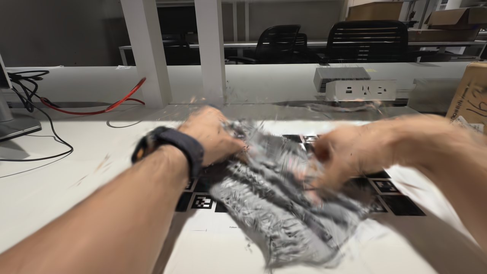
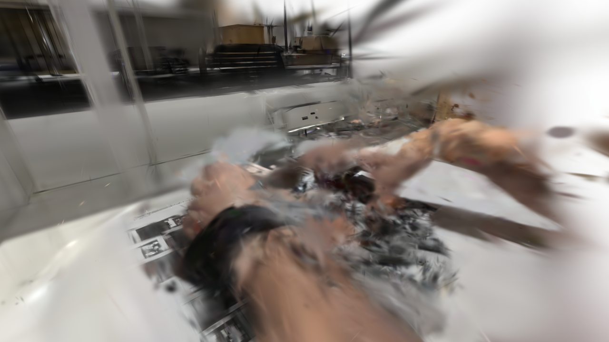

[Stage screenshot](015_headless.png)
[Stage screenshot](015_visible.png)

### 016 - textile: native_detail begins

2026-10-09T05:48:38.215330+00:00 / short trial running

600 optimizer updates from the immutable 10k whole-scene parent, edge 1920; preset baseline. Same checkpoint/RNG, full pixels and three held-out times.

[Stage screenshot](016_headless.png)
[Stage screenshot](016_visible.png)

### 017 - textile: native_detail finished

2026-10-09T05:50:26.246243+00:00 / screen completed; review pending

Nine validation camera images. Common whole-frame 24.1670 dB; motion 23.4532 dB; SSIM 0.84928. 450000 Gaussians; current-run elapsed 95.6s; peak allocated 2.03 GiB. Orbit checked separately; scores do not certify metric geometry.

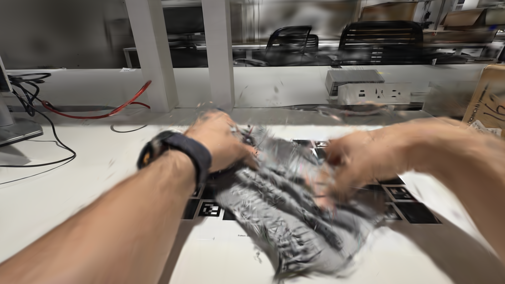
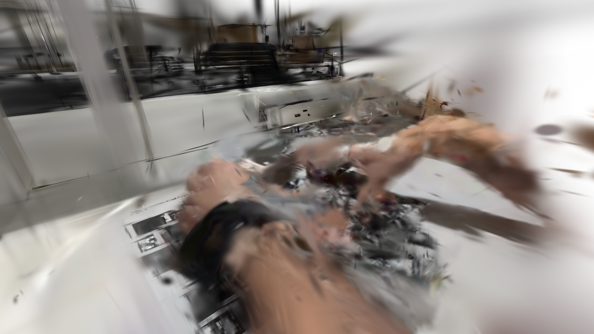

[Stage screenshot](017_headless.png)
[Stage screenshot](017_visible.png)

### 018 - textile: simpler_appearance begins

2026-10-09T05:50:30.961922+00:00 / short trial running

600 optimizer updates from the immutable 10k whole-scene parent, edge 1280; preset baseline. Same checkpoint/RNG, full pixels and three held-out times.

[Stage screenshot](018_headless.png)
[Stage screenshot](018_visible.png)

### 019 - textile: simpler_appearance finished

2026-10-09T05:51:47.101542+00:00 / screen completed; review pending

Nine validation camera images. Common whole-frame 23.8783 dB; motion 22.9658 dB; SSIM 0.83816. 450000 Gaussians; current-run elapsed 64.2s; peak allocated 1.91 GiB. Orbit checked separately; scores do not certify metric geometry.

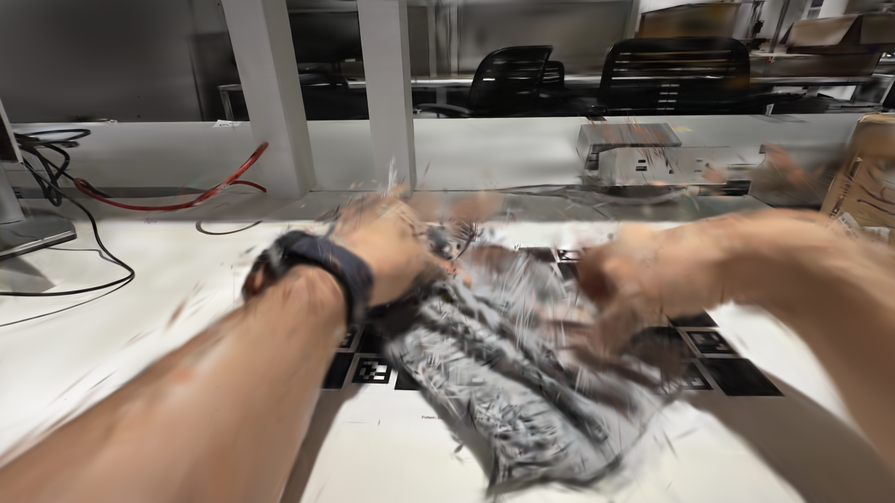
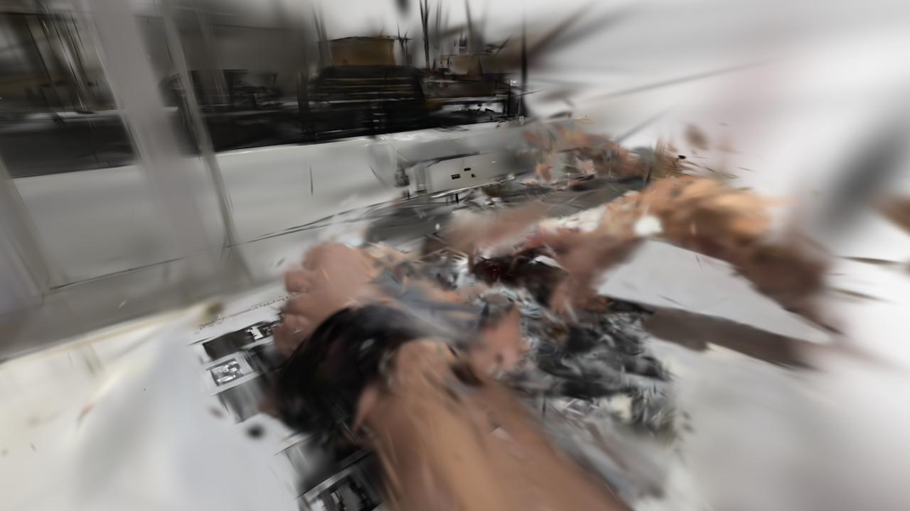

[Stage screenshot](019_headless.png)
[Stage screenshot](019_visible.png)

### 020 - textile: multi_time_support begins

2026-10-09T05:51:52.218976+00:00 / short trial running

600 optimizer updates from the immutable 10k whole-scene parent, edge 1280; preset baseline. Same checkpoint/RNG, full pixels and three held-out times.

[Stage screenshot](020_headless.png)
[Stage screenshot](020_visible.png)

### 021 - textile: multi_time_support finished

2026-10-09T05:53:10.512674+00:00 / screen completed; review pending

Nine validation camera images. Common whole-frame 25.4252 dB; motion 23.8663 dB; SSIM 0.85751. 600000 Gaussians; current-run elapsed 65.9s; peak allocated 2.47 GiB. Orbit checked separately; scores do not certify metric geometry.

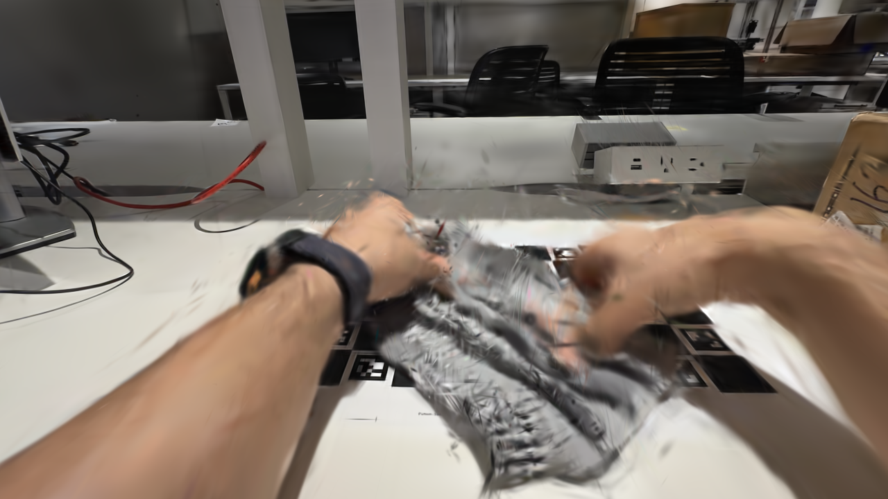
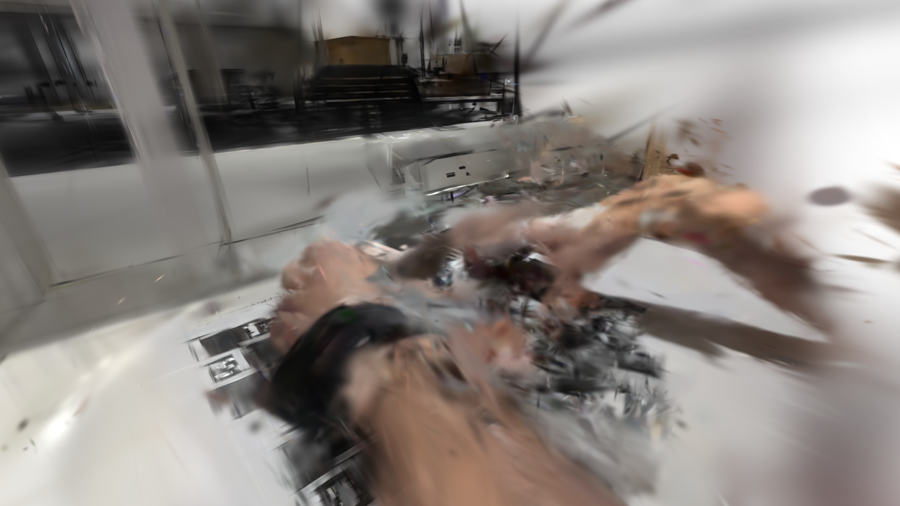

[Stage screenshot](021_headless.png)
[Stage screenshot](021_visible.png)

### 022 - textile: capacity_900k begins

2026-10-09T05:55:19.201558+00:00 / short trial running

600 optimizer updates from the immutable 10k whole-scene parent, edge 1280; preset baseline. Same checkpoint/RNG, full pixels and three held-out times.

[Stage screenshot](022_headless.png)
[Stage screenshot](022_visible.png)

### 023 - textile: capacity_900k finished

2026-10-09T05:56:39.570698+00:00 / screen completed; review pending

9 validation camera images. Common whole-frame 24.7227 dB; motion 23.4698 dB; SSIM 0.84675. 851338 Gaussians; current-run elapsed 67.9s; peak allocated 3.14 GiB. Orbit checked separately; scores do not certify metric geometry.

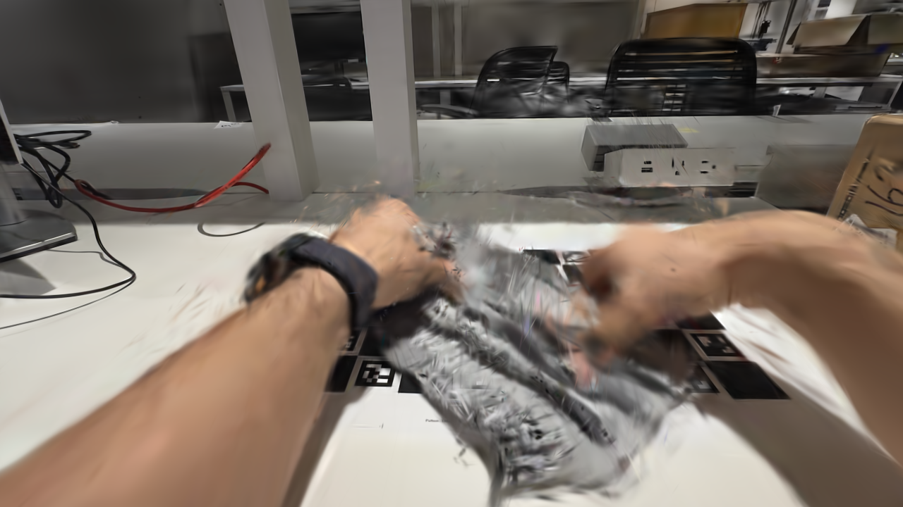
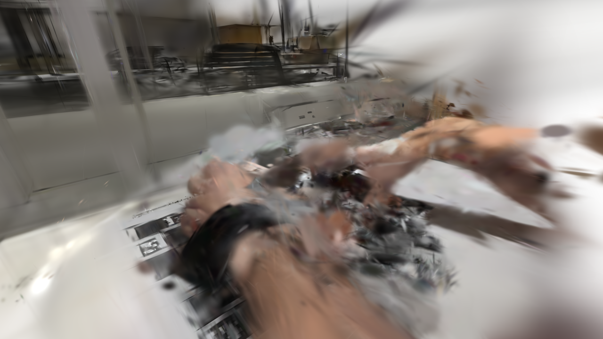

[Stage screenshot](023_headless.png)
[Stage screenshot](023_visible.png)

### 024 - textile: control begins

2026-10-09T05:56:45.529865+00:00 / short trial running

600 optimizer updates from the immutable 10k whole-scene parent, edge 1280; preset baseline. Same checkpoint/RNG, full pixels and three held-out times.

[Stage screenshot](024_headless.png)
[Stage screenshot](024_visible.png)

### 025 - textile: control finished

2026-10-09T05:58:10.243699+00:00 / screen completed; review pending

45 validation camera images. Common whole-frame 23.6064 dB; motion 22.7745 dB; SSIM 0.83714. 450000 Gaussians; current-run elapsed 60.6s; peak allocated 1.92 GiB. Orbit checked separately; scores do not certify metric geometry.

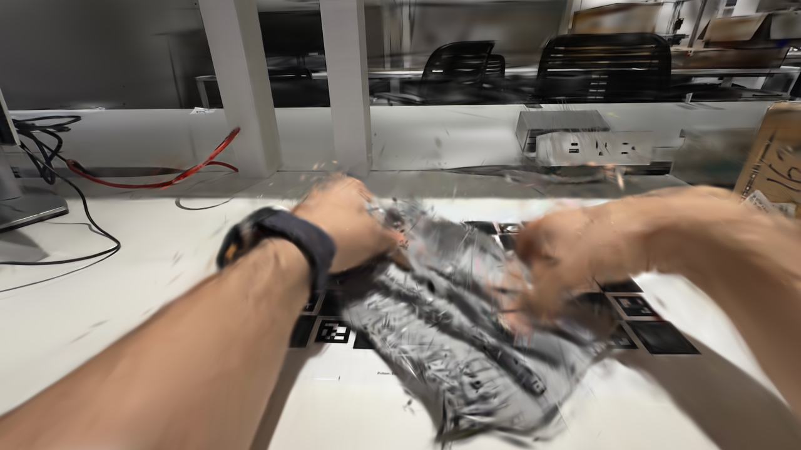
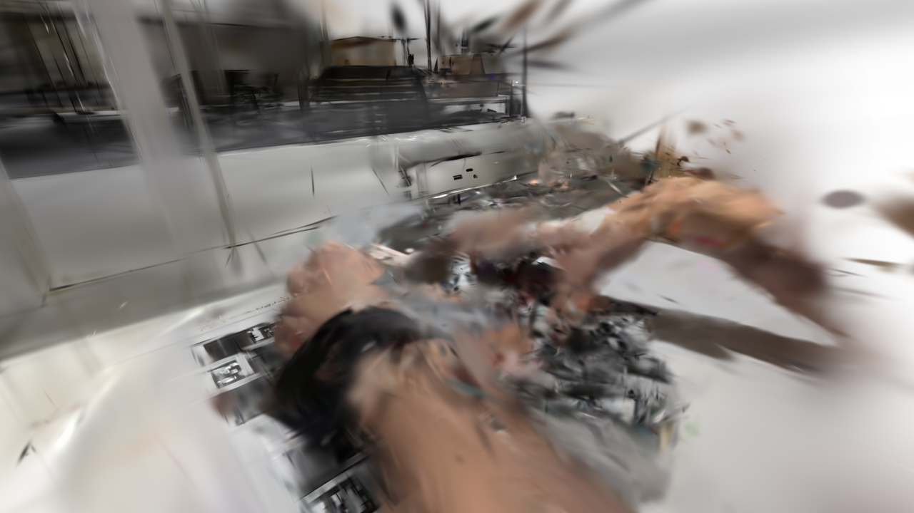

[Stage screenshot](025_headless.png)
[Stage screenshot](025_visible.png)

### 026 - textile: point_capacity begins

2026-10-09T05:58:16.192112+00:00 / short trial running

600 optimizer updates from the immutable 10k whole-scene parent, edge 1280; preset baseline. Same checkpoint/RNG, full pixels and three held-out times.

[Stage screenshot](026_headless.png)
[Stage screenshot](026_visible.png)

### 027 - textile: point_capacity finished

2026-10-09T05:59:39.072235+00:00 / screen completed; review pending

45 validation camera images. Common whole-frame 25.4806 dB; motion 23.5876 dB; SSIM 0.86276. 599905 Gaussians; current-run elapsed 66.6s; peak allocated 2.47 GiB. Orbit checked separately; scores do not certify metric geometry.

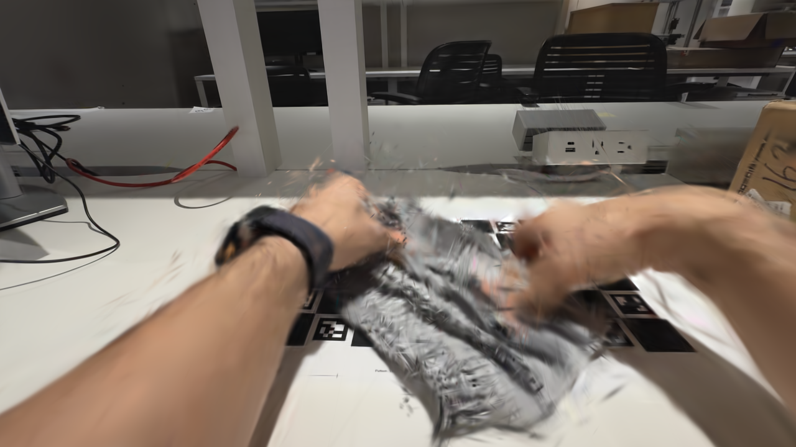
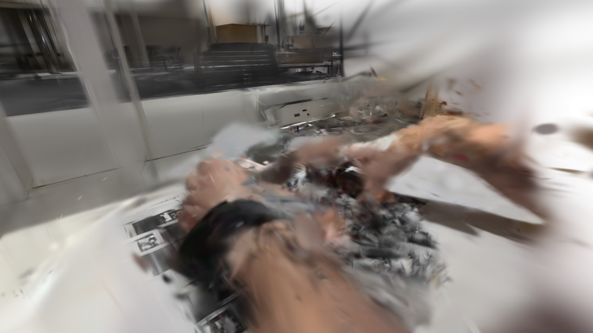

[Stage screenshot](027_headless.png)
[Stage screenshot](027_visible.png)

### 028 - textile: capacity_900k begins

2026-10-09T05:59:59.726613+00:00 / short trial running

600 optimizer updates from the immutable 10k whole-scene parent, edge 1280; preset baseline. Same checkpoint/RNG, full pixels and three held-out times.

[Stage screenshot](028_headless.png)
[Stage screenshot](028_visible.png)

### 029 - textile: capacity_900k finished

2026-10-09T06:01:24.817656+00:00 / screen completed; review pending

45 validation camera images. Common whole-frame 24.5139 dB; motion 22.9060 dB; SSIM 0.84628. 852061 Gaussians; current-run elapsed 70.5s; peak allocated 3.14 GiB. Orbit checked separately; scores do not certify metric geometry.

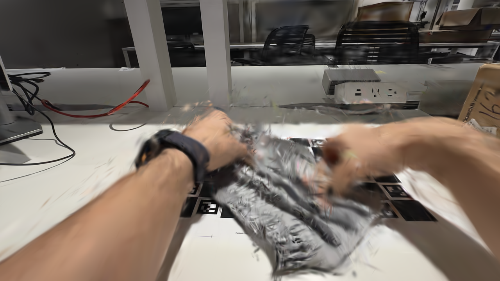
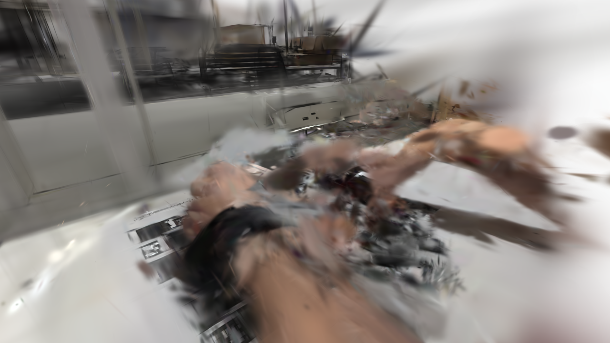

[Stage screenshot](029_headless.png)
[Stage screenshot](029_visible.png)

### 030 - textile: combination begins

2026-10-09T06:01:31.230090+00:00 / short trial running

600 optimizer updates from the immutable 10k whole-scene parent, edge 1280; preset baseline. Same checkpoint/RNG, full pixels and three held-out times.

[Stage screenshot](030_headless.png)
[Stage screenshot](030_visible.png)

### 031 - textile: combination finished

2026-10-09T06:02:53.539038+00:00 / screen completed; review pending

45 validation camera images. Common whole-frame 25.4487 dB; motion 23.5575 dB; SSIM 0.86267. 599884 Gaussians; current-run elapsed 68.8s; peak allocated 2.48 GiB. Orbit checked separately; scores do not certify metric geometry.

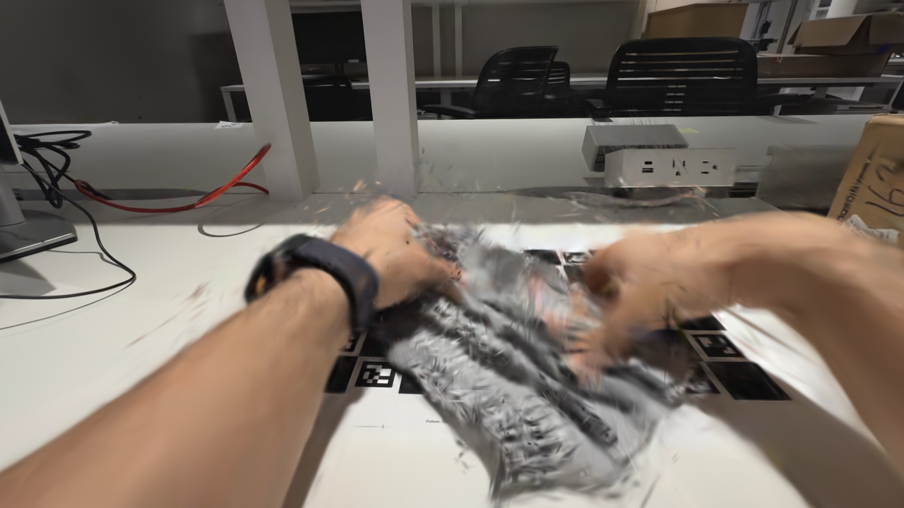
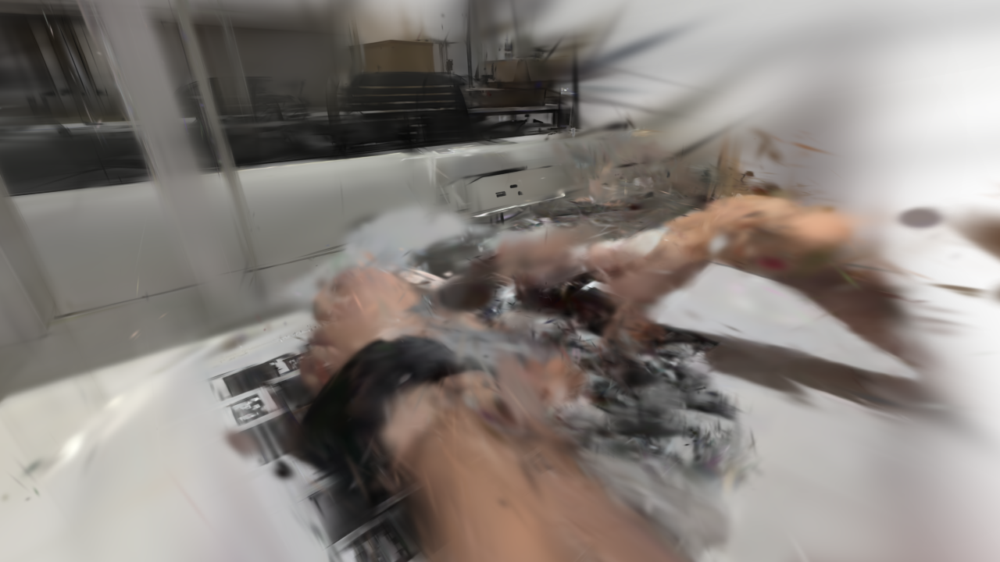

[Stage screenshot](031_headless.png)
[Stage screenshot](031_visible.png)

### 032 - yogurt: control begins

2026-10-09T06:03:00.492550+00:00 / short trial running

600 optimizer updates from the immutable 10k whole-scene parent, edge 1280; preset slow_motion. Same checkpoint/RNG, full pixels and three held-out times.

[Stage screenshot](032_headless.png)
[Stage screenshot](032_visible.png)

### 033 - yogurt: control finished

2026-10-09T06:04:48.266375+00:00 / screen completed; review pending

45 validation camera images. Common whole-frame 31.1303 dB; motion 27.1597 dB; SSIM 0.96270. 450000 Gaussians; current-run elapsed 70.1s; peak allocated 1.89 GiB. Orbit checked separately; scores do not certify metric geometry.

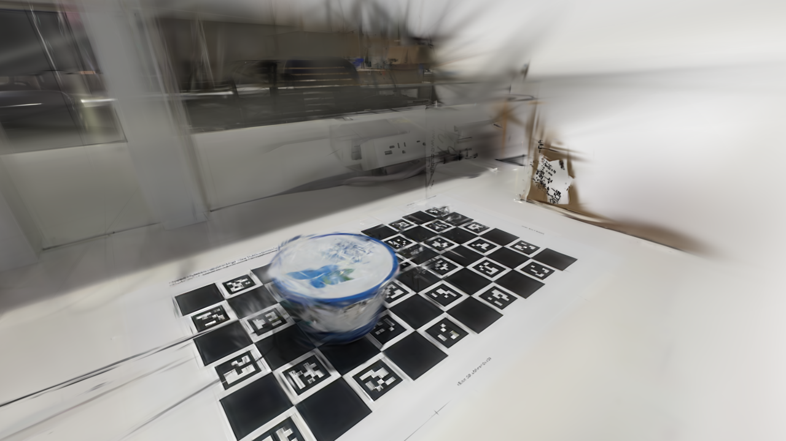

[Stage screenshot](033_headless.png)
[Stage screenshot](033_visible.png)

### 034 - yogurt: point_capacity begins

2026-10-09T06:04:55.455334+00:00 / short trial running

600 optimizer updates from the immutable 10k whole-scene parent, edge 1280; preset slow_motion. Same checkpoint/RNG, full pixels and three held-out times.

[Stage screenshot](034_headless.png)
[Stage screenshot](034_visible.png)

### 035 - yogurt: point_capacity finished

2026-10-09T06:06:19.506844+00:00 / screen completed; review pending

45 validation camera images. Common whole-frame 31.1355 dB; motion 27.0921 dB; SSIM 0.96161. 567237 Gaussians; current-run elapsed 69.6s; peak allocated 2.27 GiB. Orbit checked separately; scores do not certify metric geometry.

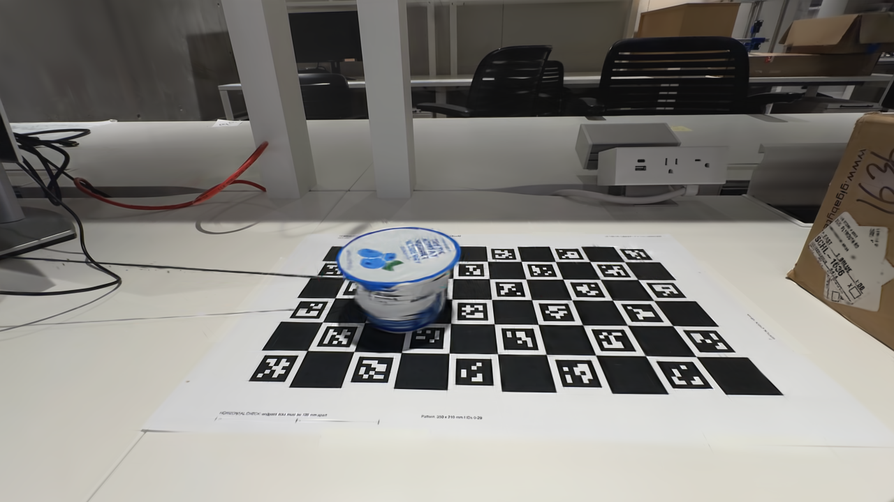
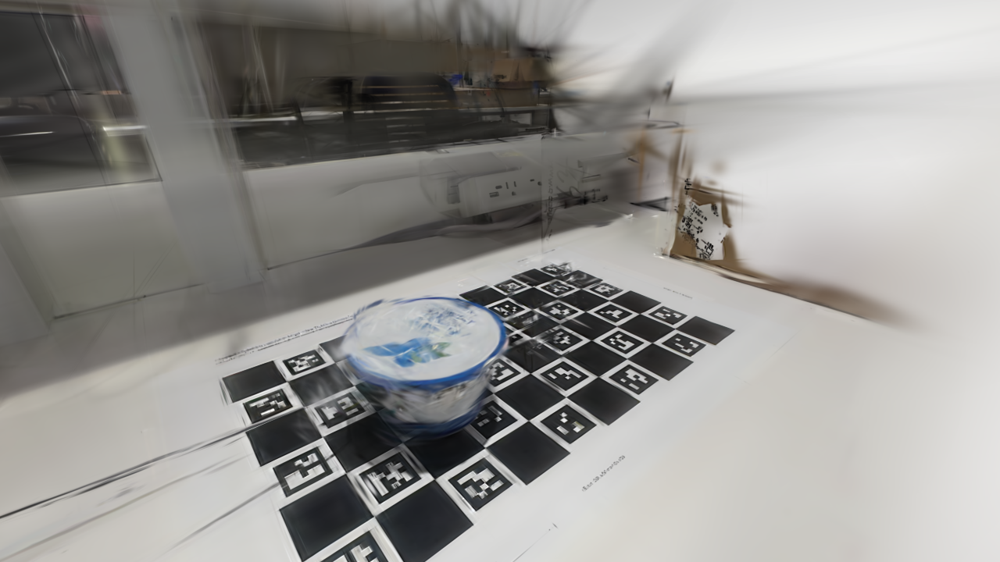

[Stage screenshot](035_headless.png)
[Stage screenshot](035_visible.png)

### 036 - yogurt: capacity_900k begins

2026-10-09T06:06:26.614826+00:00 / short trial running

600 optimizer updates from the immutable 10k whole-scene parent, edge 1280; preset slow_motion. Same checkpoint/RNG, full pixels and three held-out times.

[Stage screenshot](036_headless.png)
[Stage screenshot](036_visible.png)

### 037 - yogurt: capacity_900k finished

2026-10-09T06:07:50.492888+00:00 / screen completed; review pending

45 validation camera images. Common whole-frame 30.8732 dB; motion 27.0470 dB; SSIM 0.96123. 566928 Gaussians; current-run elapsed 69.3s; peak allocated 2.27 GiB. Orbit checked separately; scores do not certify metric geometry.

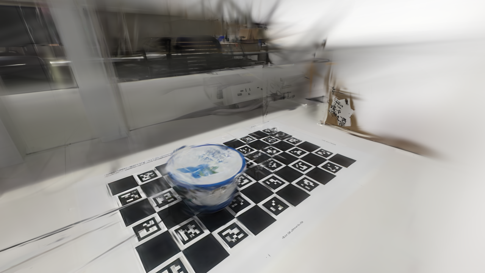

[Stage screenshot](037_headless.png)
[Stage screenshot](037_visible.png)

### 038 - yogurt: combination begins

2026-10-09T06:07:58.409632+00:00 / short trial running

600 optimizer updates from the immutable 10k whole-scene parent, edge 1280; preset slow_motion. Same checkpoint/RNG, full pixels and three held-out times.

[Stage screenshot](038_headless.png)
[Stage screenshot](038_visible.png)

### 039 - yogurt: combination finished

2026-10-09T06:09:25.692887+00:00 / screen completed; review pending

45 validation camera images. Common whole-frame 30.9872 dB; motion 26.5832 dB; SSIM 0.96153. 599304 Gaussians; current-run elapsed 72.6s; peak allocated 2.40 GiB. Orbit checked separately; scores do not certify metric geometry.

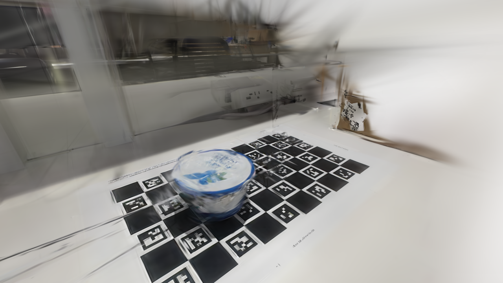

