# TF4DGS - Whole-scene 4C4D refinement

Same yogurt 330-419 and textile 587-676 source intervals. Full camera frames; hands and all visible surroundings in one jointly trained temporal model. No separate base model. 30k training, controlled parameter branches, then higher-resolution refinement. Hidden surfaces and metric accuracy remain unverified.

[Finished video comparison](comparison.html)

## Chronological record

### 001 - Whole-scene refinement authorized

2026-10-09T03:57:20.059790+00:00 / preparing

User approved all staged recommendations and required the subject, hands, marker board, table and visible surrounding scene to be reconstructed jointly. A fresh full-frame initial cloud will be built from these recordings; no old actor/background model is merged. Training intervals stay pinned for repeatable comparisons.

### 002 - Full camera frames and scene-wide seeds prepared

2026-10-09T04:01:21.822664+00:00 / prepared; geometry remains provisional

The new 1280-edge data uses every camera pixel on the original pinned native-rate intervals, including hands and all visible surroundings. Both fresh seeds contain 120000 points from whole-frame matching/registered depth at the first selected timestamp. Yogurt has 10277 retained stereo samples and textile 3289; the remainder are explicitly inferred neural depths. Ordinary SIFT correspondences were sparse and frequently inconsistent, so they do not certify camera accuracy. Thousands of filtered MASt3R correspondences fit the provisional cameras below 2 pixels; off-board and hidden geometry still require visual checks. No previous actor or table models were imported.

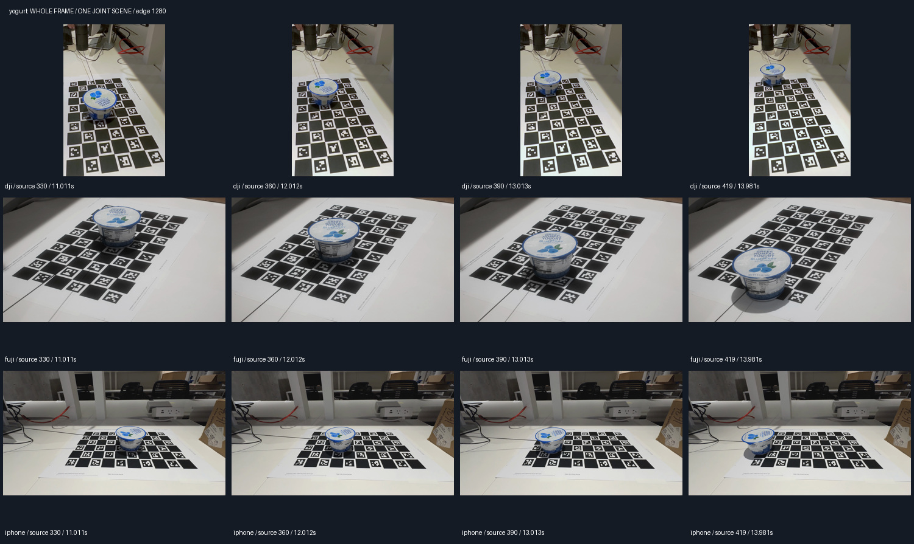
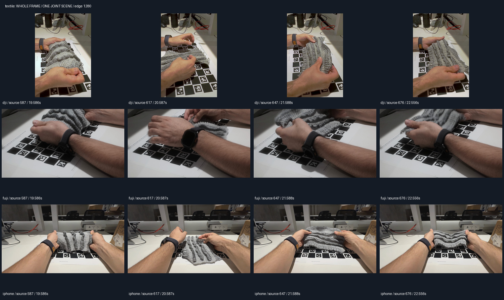

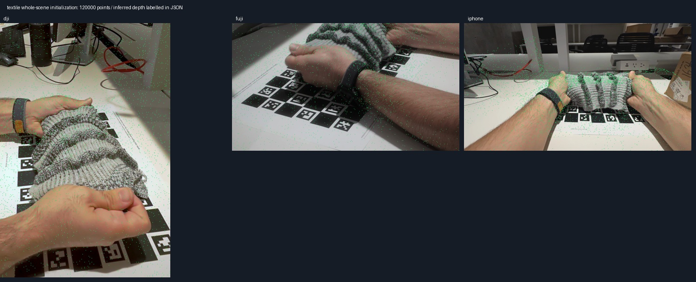

[Stage screenshot](002_full_scene_preparation.png)
[Stage screenshot](003_visible_full_scene_preparation.png)

### 003 - Timing audit completed; native whole-scene smoke training started

2026-10-09T04:07:43.298176+00:00 / audited; training smoke

All +/-2-frame hypotheses were checked at two training-only action timestamps. Textile Fuji favors the existing timeline; DJI varies by timestamp. Yogurt Fuji favors a 1-2-frame earlier sample, but correspondence/calibration ambiguity prevents a verified sensor timing claim. The common original timeline remains pinned. Whole-scene smoke training now checks gradients, opacity decay and point growth before a fresh full 30k learning-rate schedule. Motion priority is derived only from training RGB; it does not exclude any camera pixels.

### 004 - textile_baseline_01 started

2026-10-09T04:08:49.841410+00:00 / training

Full camera frames at edge 1280. One joint model including hands/subject/visible surroundings. Preset baseline, stop 12000, parent , resolution-refinement False. Checkpoints, RNG and input provenance are preserved.

[Stage screenshot](004_joint_scene_training.png)

### 005 - Higher-resolution full-frame inputs prepared

2026-10-09T04:16:03.455375+00:00 / prepared; baseline training continues

Both captures now have verified 90-frame full-view datasets at edge1920 and native source resolution: Fuji/iPhone3840x2160, DJI1536x2304. No upscaling, separate base model or scene crop is used. The ongoing fresh baseline uses a 30k horizon and has grown to the 450k-point budget. Later resolution stages will warm-start the selected single scene model with lower optimization rates. Motion-priority maps are training-only RGB variance and still supervise every background pixel.

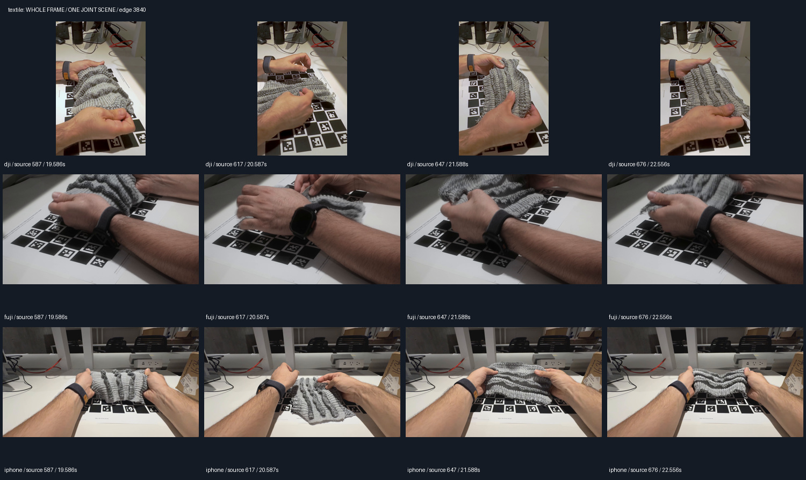
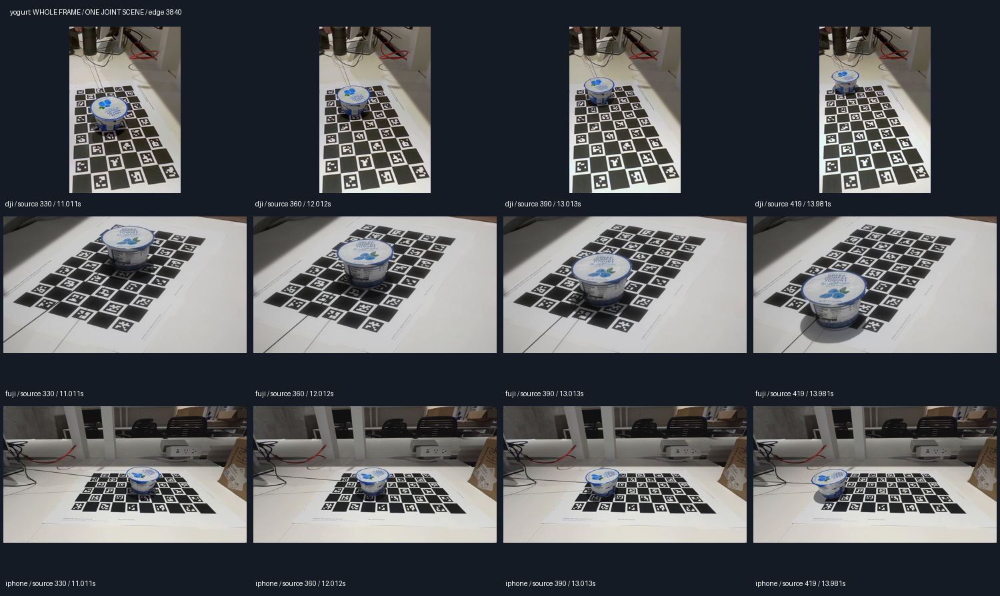

[Stage screenshot](005_native_input_preparation.png)

### 006 - Whole-scene smoke and checkpoint review infrastructure verified

2026-10-09T04:24:27.469656+00:00 / smoke passed; baseline training continues

The earlier 650-update textile smoke completed with finite optimization, temporal opacity decay and densification: 126435 Gaussians, 19.76 dB whole-frame and 18.06 dB motion-region validation PSNR. The full run is separate and uses the fresh 30k horizon. A saved-checkpoint gallery and chronological checkpoint screenshot callbacks are now prepared. No metric geometry accuracy is inferred from these image scores.

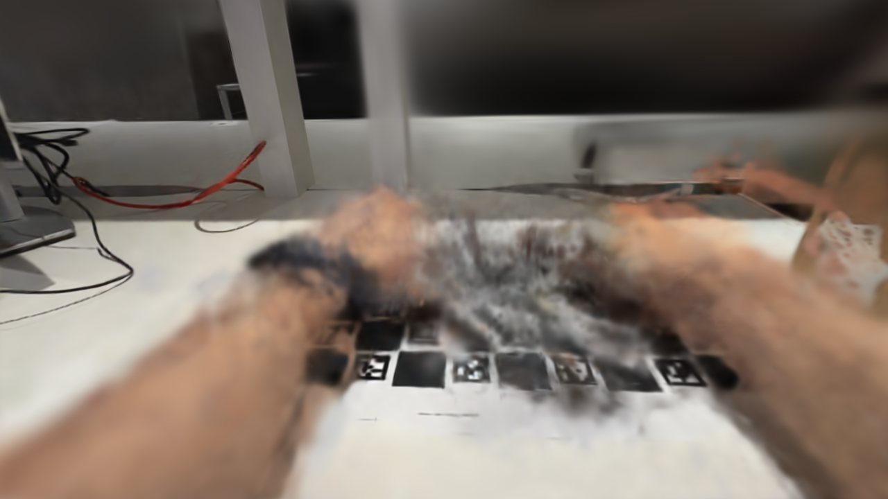
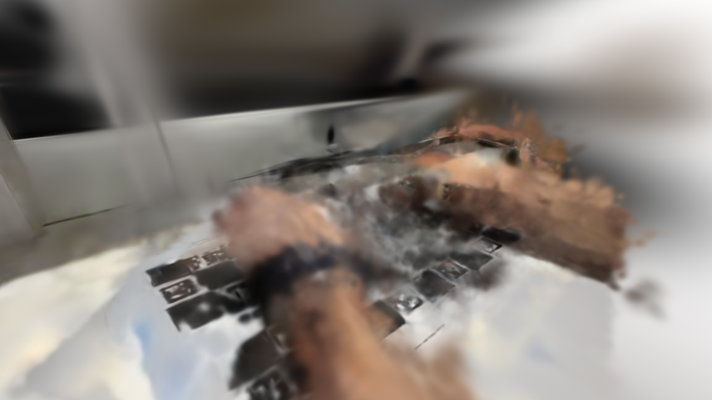

[Stage screenshot](006_smoke_verified.png)

### 007 - Textile baseline reached 10000 updates

2026-10-09T04:24:46.117057+00:00 / checkpoint saved; training continues

The immutable whole-scene 10000-update checkpoint is saved for matched parameter branches. Measured textile validation is 24.01 dB whole-frame and 22.77 dB in the motion-priority region. Both hands and the visible workspace are reconstructed jointly; textile streaking remains visible. The first screenshot of this stage contained mistyped score values; this entry now quotes the saved metrics JSON. That original screenshot is retained as a documentation error, and a corrected screenshot follows. Next compare all presets at 12000 updates.

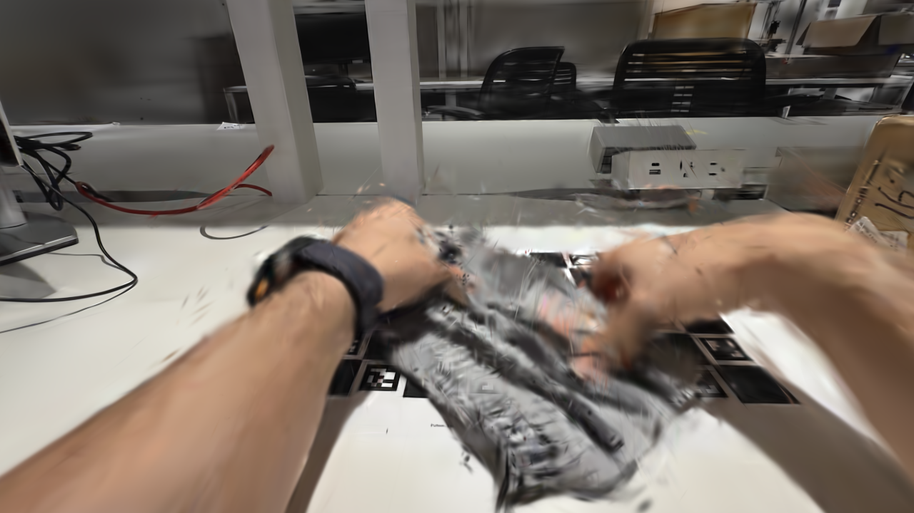
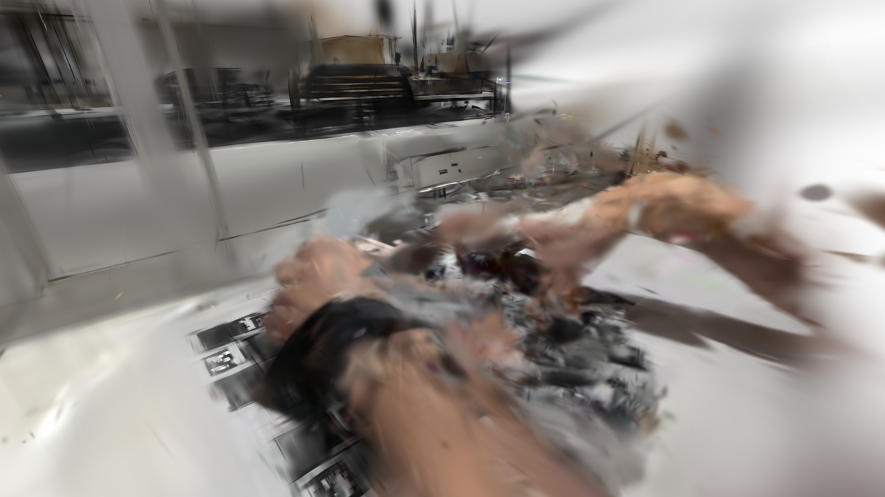

[Stage screenshot](007_textile_10000_checkpoint.png)
[Stage screenshot](007_textile_10000_corrected.png)

### 008 - textile_baseline_01 completed 12000 updates

2026-10-09T04:26:11.425250+00:00 / trained; visual review pending

Full-frame validation PSNR 23.57 dB; motion-region PSNR 22.69 dB; SSIM at edge1280 0.834. 450000 Gaussians, peak allocated 3.89 GiB. Whole-frame scores do not certify new-view geometry or material correspondence.

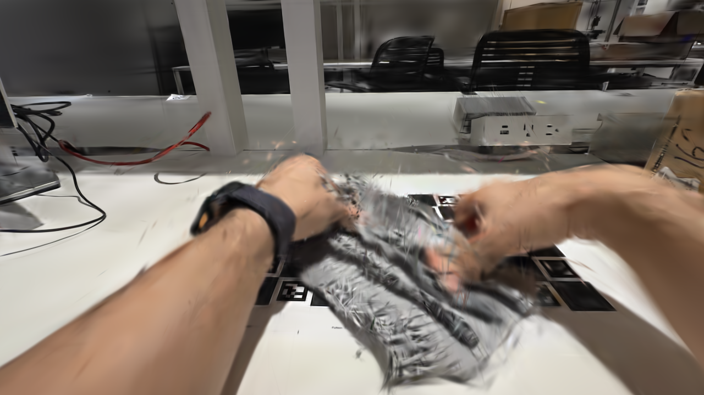
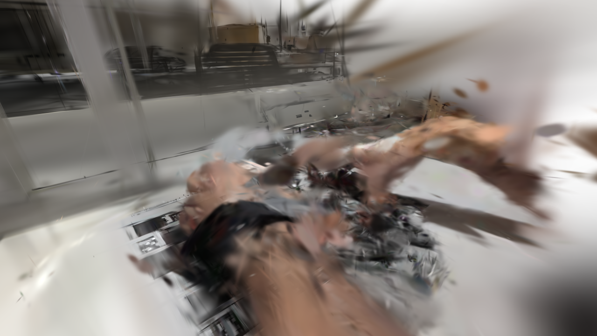

[Stage screenshot](textile_baseline_01_step_012000_completed.png)

### 009 - yogurt_baseline_01 started

2026-10-09T04:26:12.841372+00:00 / training

Full camera frames at edge 1280. One joint model including hands/subject/visible surroundings. Preset baseline, stop 12000, parent , resolution-refinement False. Checkpoints, RNG and input provenance are preserved.

### 010 - Earlier project GPU preview paused for training capacity

2026-10-09T04:40:03.669542+00:00 / training continues; earlier models preserved

Verified PID13976 served the old Serve-TextileGaussianPreview.py on loopback8104, then paused only that project preview. This releases cached GPU memory for the upcoming native-resolution whole-scene training. Its data/models and CPU documentation/demo servers remain available. Restart later with the tf4dgs-dynamic Python and scripts/Serve-TextileGaussianPreview.py.

[Stage screenshot](010_gpu_capacity.png)

### 011 - yogurt_baseline_01 checkpoint 10000 updates

2026-10-09T04:40:36.043256+00:00 / checkpoint; training continues

Joint full-frame model at edge 1280; 450000 Gaussians. Validation whole-frame PSNR 30.44 dB, motion-priority PSNR 26.20 dB. Every primitive remains trainable. Camera-view scores do not verify novel-view geometry.

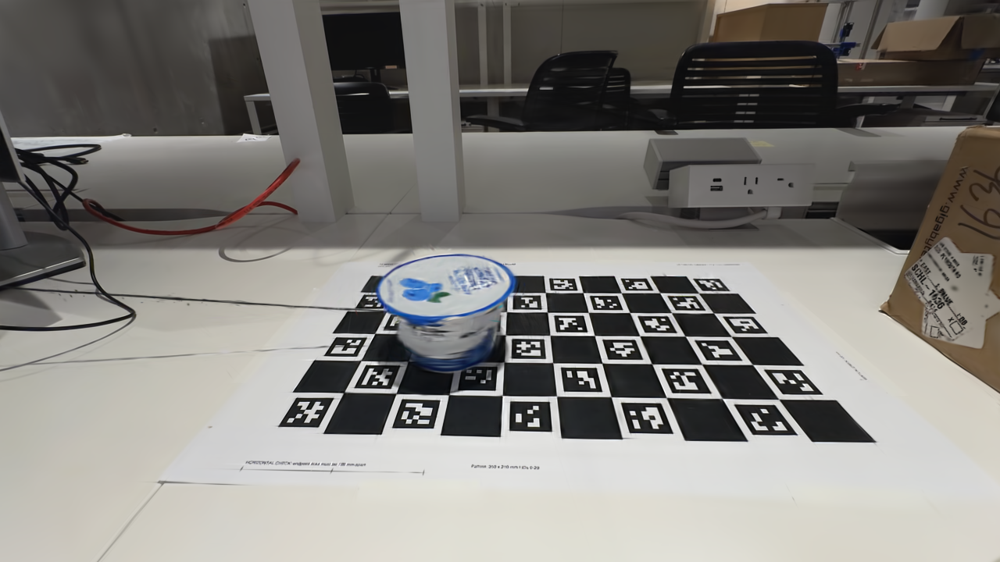
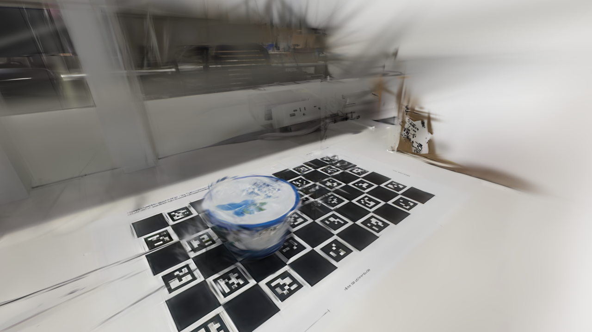

[Stage screenshot](yogurt_baseline_01_step_010000_checkpoint.png)

### 012 - Initialization wrapper status audited

2026-10-09T04:41:28.918860+00:00 / shell exit anomaly; saved seeds verified

The earlier two-capture initialization shell returned exit1 after both seed summaries and NPZ clouds had been written, without a Python traceback. This wrapper outcome is retained as an unsuccessful shell invocation; its precise cause is unconfirmed. Both artifacts were separately checked: 120000 finite colored points each with recorded SHA-256s and first-timestamp provenance. Training starts from those verified outputs, without rerunning or overwriting the seeds. Subsequent batch runners propagate native failures explicitly.

[Stage screenshot](012_initialization_status_audit.png)

### 013 - yogurt_baseline_01 completed 12000 updates

2026-10-09T04:43:42.677514+00:00 / trained; visual review pending

Full-frame validation PSNR 30.32 dB; motion-region PSNR 26.69 dB; SSIM at edge1280 0.958. 450000 Gaussians, peak allocated 3.78 GiB. Whole-frame scores do not certify new-view geometry or material correspondence.

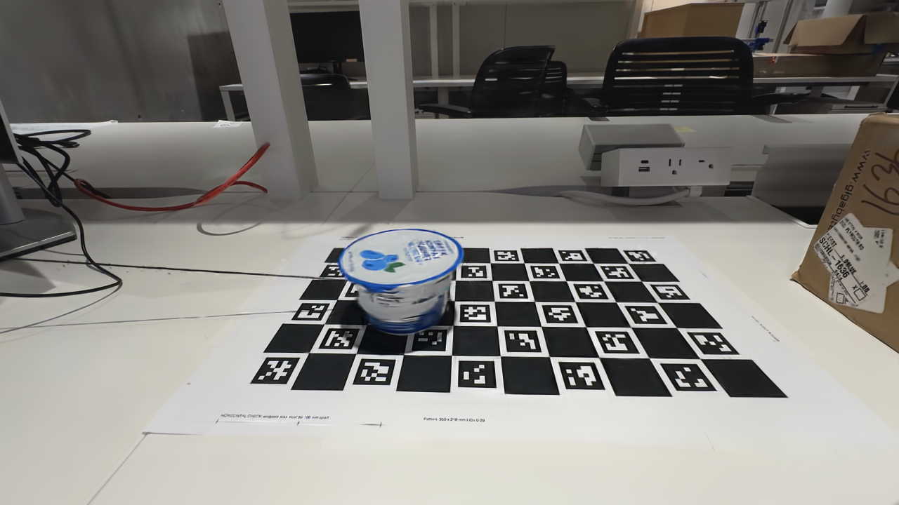
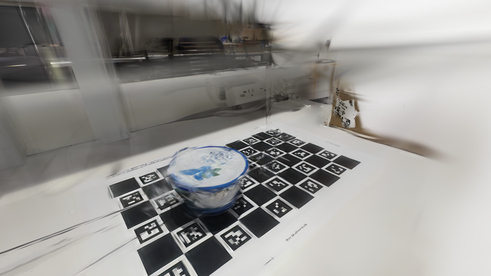

[Stage screenshot](yogurt_baseline_01_step_012000_completed.png)

### 014 - textile_slow_motion_01 started

2026-10-09T04:44:32.436208+00:00 / training

Full camera frames at edge 1280. One joint model including hands/subject/visible surroundings. Preset slow_motion, stop 12000, parent outputs/4c4d_scene_001/textile/baseline_01/checkpoint_010000.pth, resolution-refinement False. Checkpoints, RNG and input provenance are preserved.

### 015 - textile_slow_motion_01 completed 12000 updates

2026-10-09T04:47:30.907427+00:00 / trained; visual review pending

Full-frame validation PSNR 22.95 dB; motion-region PSNR 22.58 dB; SSIM at edge1280 0.824. 450000 Gaussians, peak allocated 2.77 GiB. Whole-frame scores do not certify new-view geometry or material correspondence.

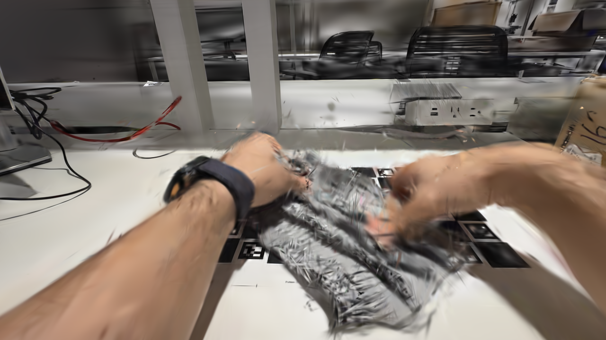
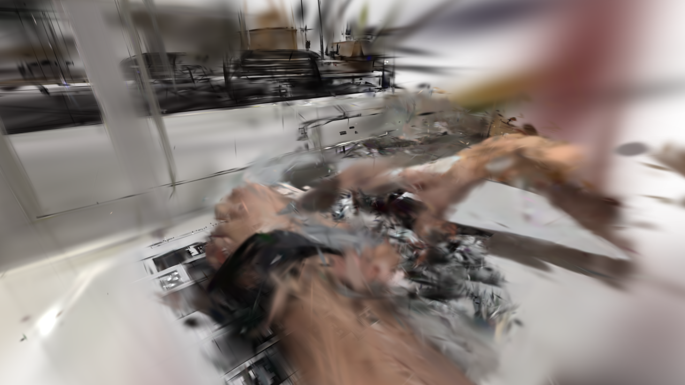

[Stage screenshot](textile_slow_motion_01_step_012000_completed.png)

### 016 - textile_gentle_decay_01 started

2026-10-09T04:47:32.592608+00:00 / training

Full camera frames at edge 1280. One joint model including hands/subject/visible surroundings. Preset gentle_decay, stop 12000, parent outputs/4c4d_scene_001/textile/baseline_01/checkpoint_010000.pth, resolution-refinement False. Checkpoints, RNG and input provenance are preserved.

### 017 - textile_gentle_decay_01 completed 12000 updates

2026-10-09T04:50:29.884833+00:00 / trained; visual review pending

Full-frame validation PSNR 23.66 dB; motion-region PSNR 22.68 dB; SSIM at edge1280 0.835. 450000 Gaussians, peak allocated 2.77 GiB. Whole-frame scores do not certify new-view geometry or material correspondence.

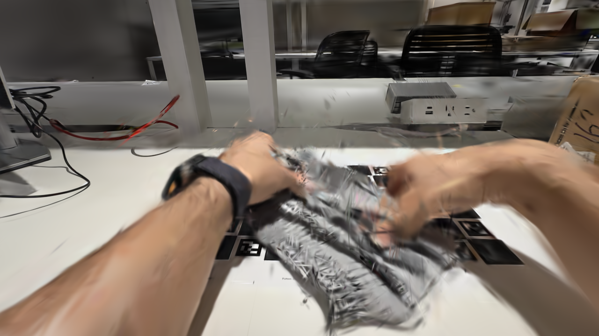
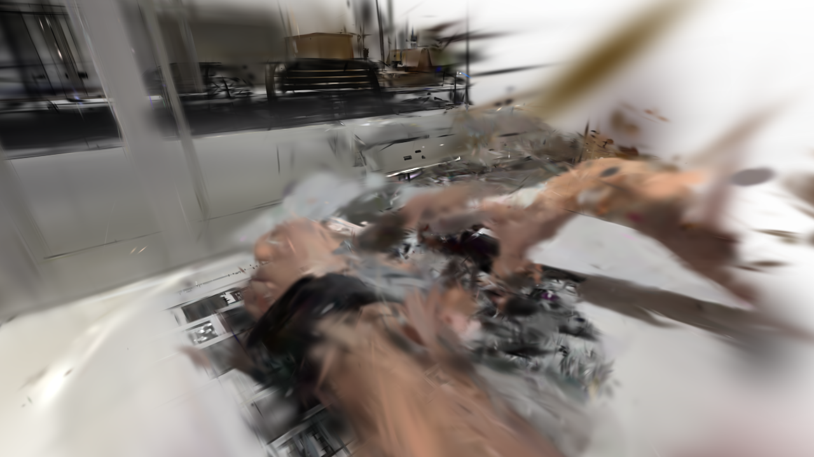

[Stage screenshot](textile_gentle_decay_01_step_012000_completed.png)

### 018 - yogurt_slow_motion_01 started

2026-10-09T04:50:31.498731+00:00 / training

Full camera frames at edge 1280. One joint model including hands/subject/visible surroundings. Preset slow_motion, stop 12000, parent outputs/4c4d_scene_001/yogurt/baseline_01/checkpoint_010000.pth, resolution-refinement False. Checkpoints, RNG and input provenance are preserved.

### 019 - yogurt_slow_motion_01 completed 12000 updates

2026-10-09T04:53:54.618711+00:00 / trained; visual review pending

Full-frame validation PSNR 30.70 dB; motion-region PSNR 27.68 dB; SSIM at edge1280 0.963. 450000 Gaussians, peak allocated 2.71 GiB. Whole-frame scores do not certify new-view geometry or material correspondence.

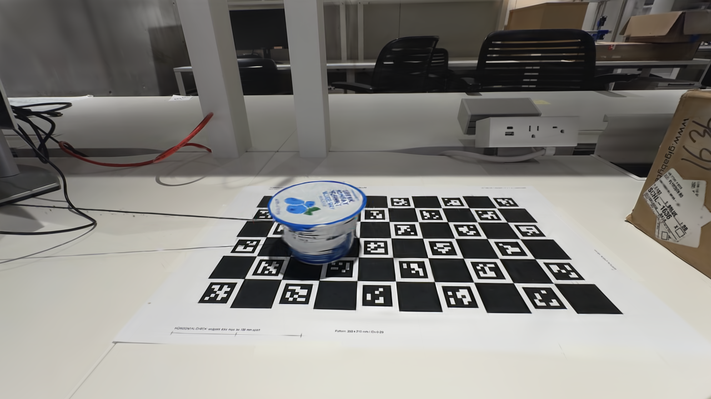
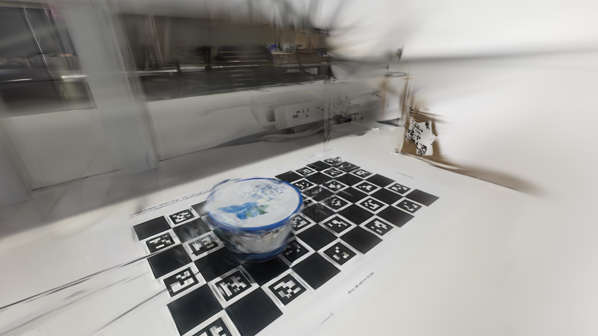

[Stage screenshot](yogurt_slow_motion_01_step_012000_completed.png)

### 020 - yogurt_gentle_decay_01 started

2026-10-09T04:53:56.246322+00:00 / training

Full camera frames at edge 1280. One joint model including hands/subject/visible surroundings. Preset gentle_decay, stop 12000, parent outputs/4c4d_scene_001/yogurt/baseline_01/checkpoint_010000.pth, resolution-refinement False. Checkpoints, RNG and input provenance are preserved.

[Stage screenshot](021_visible_tuning_progress.png)

### 021 - yogurt_gentle_decay_01 completed 12000 updates

2026-10-09T04:57:17.341270+00:00 / trained; visual review pending

Full-frame validation PSNR 31.18 dB; motion-region PSNR 26.87 dB; SSIM at edge1280 0.961. 450000 Gaussians, peak allocated 2.71 GiB. Whole-frame scores do not certify new-view geometry or material correspondence.

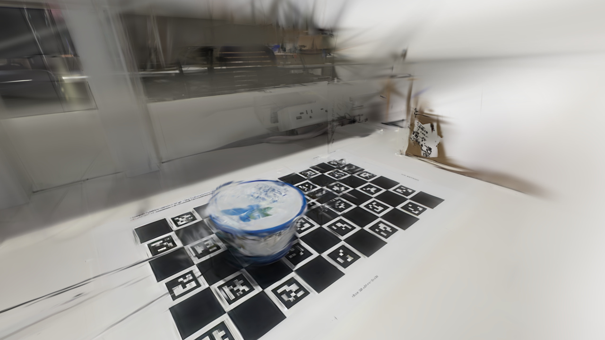

[Stage screenshot](yogurt_gentle_decay_01_step_012000_completed.png)

### 022 - textile_fast_time_01 started

2026-10-09T04:58:15.737382+00:00 / training

Full camera frames at edge 1280. One joint model including hands/subject/visible surroundings. Preset fast_time, stop 12000, parent outputs/4c4d_scene_001/textile/baseline_01/checkpoint_010000.pth, resolution-refinement False. Checkpoints, RNG and input provenance are preserved.

### 023 - textile_fast_time_01 completed 12000 updates

2026-10-09T05:01:14.481517+00:00 / trained; visual review pending

Full-frame validation PSNR 23.16 dB; motion-region PSNR 22.22 dB; SSIM at edge1280 0.828. 450000 Gaussians, peak allocated 2.75 GiB. Whole-frame scores do not certify new-view geometry or material correspondence.

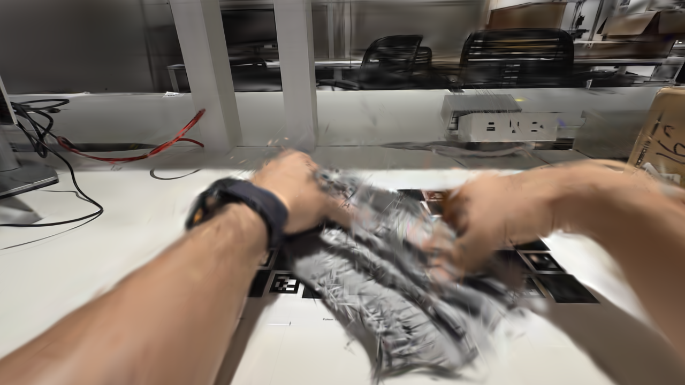
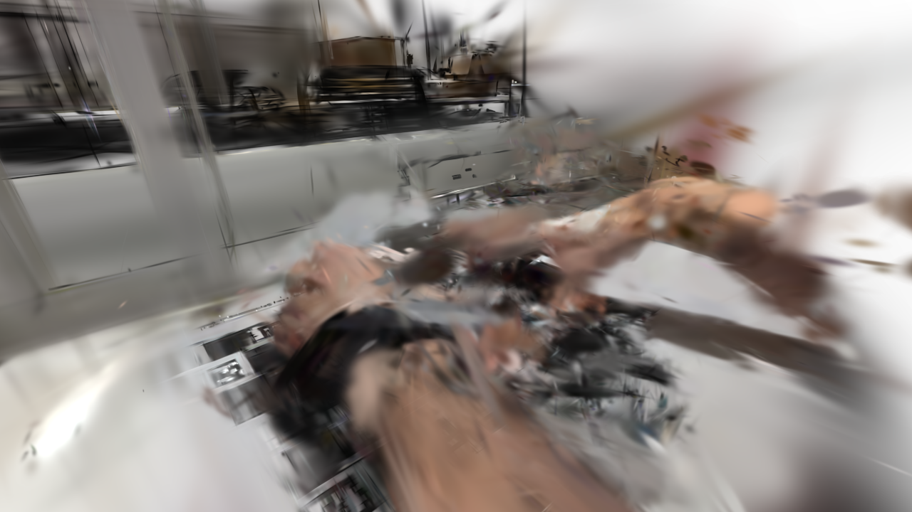

[Stage screenshot](textile_fast_time_01_step_012000_completed.png)

### 024 - Matched parameter choices reviewed

2026-10-09T05:02:05.159593+00:00 / settings selected; longer training starts

Seven matched 12000-update candidates were compared. Textile retains baseline:22.69dB moving-region PSNR; slower22.58, gentler22.68 and faster-time22.22 do not clear visible cloth streaking. Yogurt selects slower motion:27.68dB moving-region PSNR versus26.69 baseline and26.87 gentler decay. Whole-frame and orbit evidence are retained in comparison.html and selection.json. Both chosen joint scenes now continue to30000 updates before higher-resolution stages; no separate/frozen background is imported.

[Stage screenshot](024_visible_parameter_selection.png)

### 025 - textile_baseline_01 started

2026-10-09T05:02:33.339209+00:00 / training

Full camera frames at edge 1280. One joint model including hands/subject/visible surroundings. Preset baseline, stop 30000, parent , resolution-refinement False. Checkpoints, RNG and input provenance are preserved.

### 026 - Video encoder metadata corrected and verified

2026-10-09T05:06:19.054145+00:00 / export preflight passed; final models pending

A two-frame 30fps encoder preflight produced the requested BT709 matrix/range but initially omitted transfer/primaries tags. Explicit setparams now supplies matching frame metadata, verified by ffprobe: matrix, transfer and primaries BT709, range tv. The initial and corrected smoke files remain in ignored workflow storage. Final selected-model videos will use direct continuous-time queries, CRF15, native camera dimensions and exact30fps; no training model or source frame was changed.

[Stage screenshot](027_encoder_preflight.png)

### 027 - textile_baseline_01 checkpoint 20000 updates

2026-10-09T05:13:27.678654+00:00 / checkpoint; training continues

Joint full-frame model at edge 1280; 450000 Gaussians. Validation whole-frame PSNR 25.95 dB, motion-priority PSNR 24.05 dB. Every primitive remains trainable. Camera-view scores do not verify novel-view geometry.

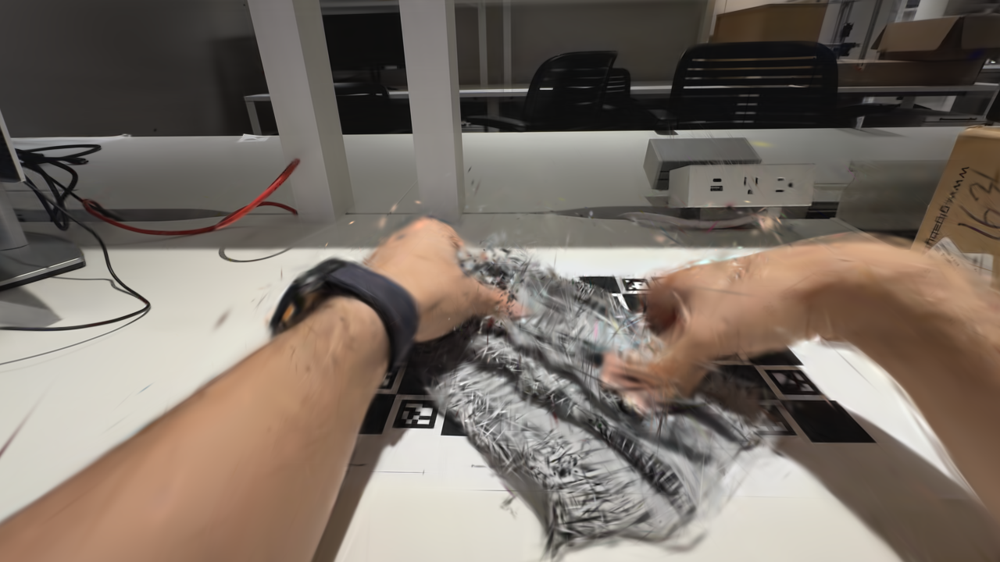
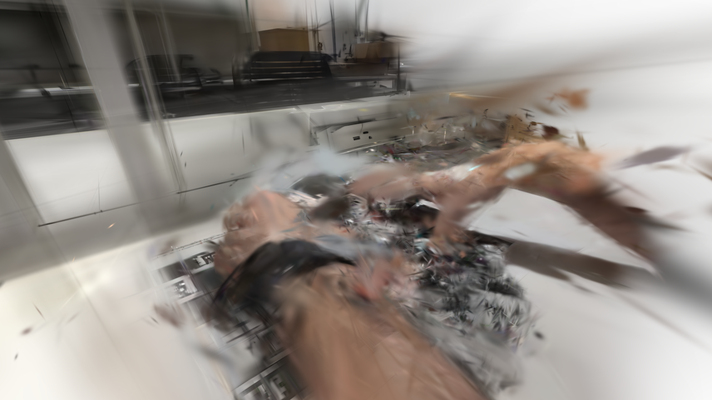

[Stage screenshot](textile_baseline_01_step_020000_checkpoint.png)

### 028 - textile_baseline_01 failed

2026-10-09T05:14:22.293260+00:00 / failed; checkpoints retained

Training returned 1. Full log: .local/workflows/4c4d_scene_001/textile_baseline_01_20261009_050233.log. Earlier successful runs are preserved; no restart or silent overwrite.

[Stage screenshot](textile_baseline_01_failed.png)

### 029 - Short-scene experiment closed; saved 20k checkpoint retained

2026-10-09T05:34:57.408975+00:00 / closed; continuation failed before user requested end

Textile reached 20,500 updates before Windows denied atomic replacement of live_progress.json. Immutable checkpoint and evaluated renders at 20,000 are safe. Whole-frame PSNR 25.9527 dB, motion PSNR 24.0460 dB; cloth streaks and ghosting remain. Yogurt 30k continuation never started. Eight brief hypotheses will be compared in a new experiment before full-recording training.

