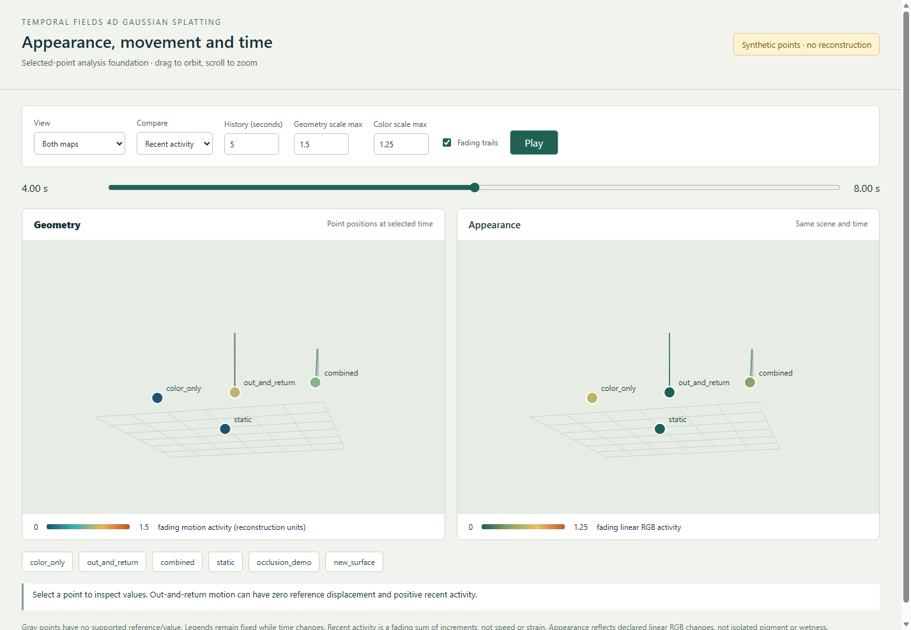
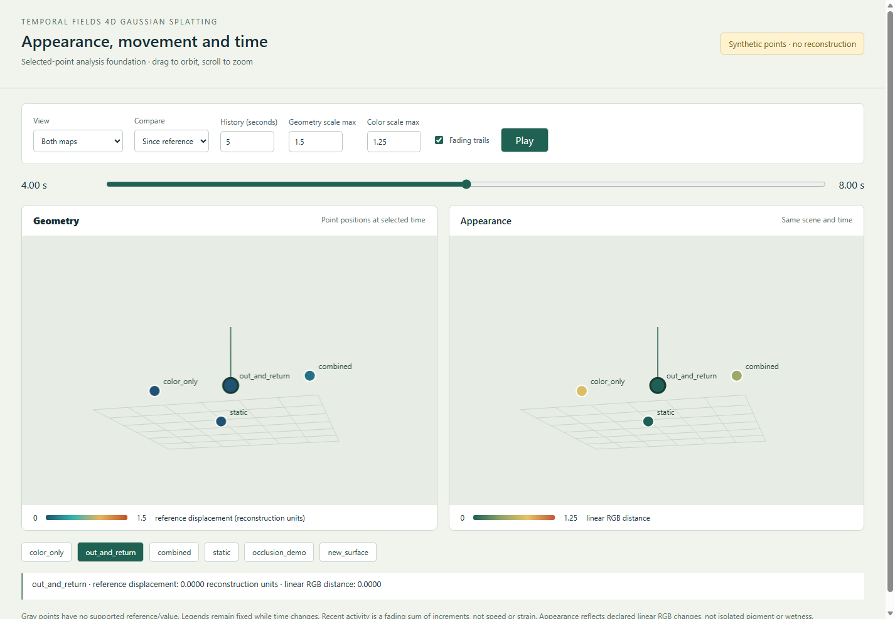

# Dynamic foundation validation, 2026-10-05

This report covers CPU capture preparation and **synthetic selected-point
analysis**. No real dynamic recordings or trained 4D Gaussian model are used.

- Python 3.11.16 in `tf4dgs`; local editable TF4DGS package installed, no broken
  package requirements. Portable recipe and exact Windows Conda builds saved.
- 23 automated tests passed, including a real FFmpeg/FFprobe integration test.
  Three 160 × 96 synthetic videos at 12, 8 and 16 FPS produced four synchronized
  samples per camera. Dimensions and selected-frame PNG hashes were checked
  against independent decodes. Edited plans, altered video, HDR extraction and
  repeated extraction were rejected.
- Timing tests cover offset, affine drift, variable intervals, missing
  coverage/skew and prevention of source-frame reuse. Analysis tests cover
  independent color/geometry, scale, reference boundaries, occlusion, new
  surfaces and out-and-return motion.
- A real Microsoft Edge browser exercised RGB, geometry, appearance and
  combined views, plus playback restart and scalar legends. Local API checks
  returned errors for invalid parameters. The visible preview was also opened
  and inspected; this is a read-only localhost service.

The screenshots below are captures of that real browser rendering, using
invented point tracks. At time 4 s, `out_and_return` has approximately zero
reference displacement, but positive recent activity (0.875 reconstruction
units with a 5 s history). This demonstrates why the recent mode retains the
intervening motion.

These checks establish software behavior, not sensor synchronization, learned
correspondence, color calibration, dense Gaussian quality or physical strain.
Real-data validation and GPU trainer integration are still pending. The
[foundation guide](../../docs/DYNAMIC_FOUNDATION.md) gives commands and limits;
the [capture checklist](../../docs/CAPTURE_CHECKLIST.md) describes the first
recording. Static source revisions and native installation were preserved.
