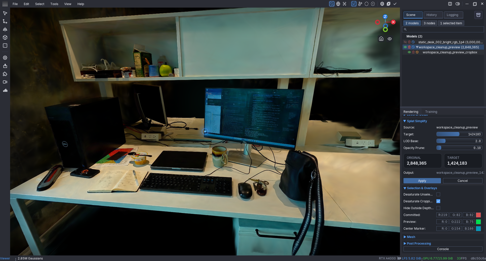

# Workspace cleanup preview — awaiting review

The editable `workspace_cleanup_preview` in LichtFeld contains 2,848,365
undeleted Gaussians, down from 3,000,000. The original bright model remains
hidden and locked, with all 3,000,000 Gaussians intact. No cleaned PLY or scene
has been exported or saved. Keep the app open until the user reviews the result.

The existing oriented crop is retained as a reversible rendering filter.
Its approximate footprint is 3 x 3 metres and its height is 4.5 metres, using
the user's 150 cm desktop width as a rough scale reference. This is not a
surveyed metric calibration. The crop bounds were not changed during cleanup.

Three native Gaussian deletion operations were performed on the duplicate:

1. Remove very faint splats, very large faint splats, and large bright faint
   splats: 51,478 newly deleted.
2. Remove additional faint/large splats and bright blobs in the window region:
   99,965 newly deleted.
3. Remove 192 additional bright splats selected around a window glare spot.

The total is 151,635 deleted splats (5.05%). These filters are heuristics,
not a reliable classification of every artifact. Some haze, incomplete room
surfaces and window glare remain; aggressive removal could damage real geometry.
No global simplification or merging was applied. The desk, keyboard, notebook,
cup, cables and bag were visually checked in the close view.

## Review images

- [Initial desk view](28_cleanup_before.png)
- [Whole-room artifacts before cropping](29_cleanup_wide_before.png)
- [Crop preview before Gaussian cleanup](31_cleanup_oriented_crop.png)
- [Cleaned crop overview](33_cleanup_after_wide.png)
- [Cleaned desk detail](34_cleanup_after_desk.png)

The overview images use different camera poses; they are not a pixel-aligned
quality comparison. The desk detail uses the initial desk camera. The final
preview uses the 3DGUT raster backend, SH degree 3 and render scale 1.0.
The brighter PLY remains a viewing derivative; use the original training output
for future appearance analysis.

## Resume if the app closes

The unsaved edits will be lost when the scene closes. The source PLY and native
training checkpoint remain intact. `cleanup_recipe.json` records the exact
crop and numerical deletion predicates, and `cleanup_window_spot_indices.json`
records the last local Gaussian selection against the unchanged source PLY.
Recreate an editable duplicate named `workspace_cleanup_preview` from that
source, then replay the predicates and spot indices using LichtFeld's native
selection/deletion pipeline. Do not save a cleaned model until the user accepts
the preview. Crop rendering and eventual export cropping must be checked
separately when a save is authorized.

Native Gaussian deletions used `lf.pipeline.edit.delete_().execute()` and
created undo history. A hidden original contributes to the full scene selection
index space; Python `scene.set_selection` takes indices for the visible model,
which are remapped by the selection service. Check selection ownership before
replaying edits.
