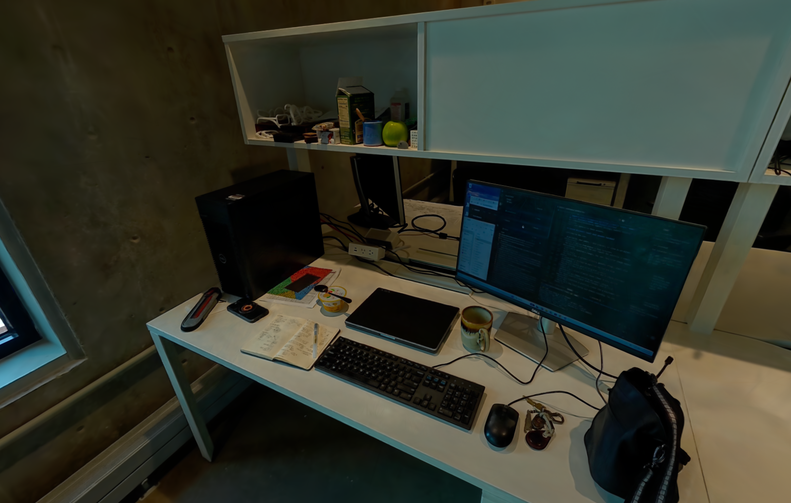
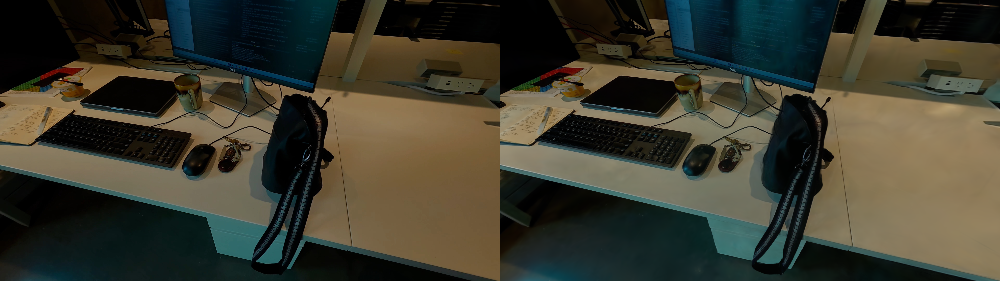

# static_desk_002 — daylight desk reconstruction

Project: **Temporal Fields 4D Gaussian Splatting (TF4DGS)**.
Date: 2026-10-04. Time zone: America/New_York (Boston).

## Current status

**Completed.** COLMAP registered all 300 images. LichtFeld finished 30,000
full-resolution MRNF iterations with three million Gaussians. Final held-out
PSNR is **25.855387 dB** and SSIM is **0.875689**, the best of the three measured
checkpoints. The original and a separate brighter PLY both reopened successfully
in the visible GUI. The brighter version is left open for inspection.

## Inputs and artifact locations

Paths are relative to `C:\Users\mnijat\Desktop\Git\TF4DGS`.

| Artifact | Location |
| --- | --- |
| Original frames, preserved | `data/static_desk_002/images` |
| Original recording | `data/static_desk_002/static_desk_002.MOV` |
| COLMAP database | `data/static_desk_002/database.db` |
| Saved GUI project and settings | `data/static_desk_002/project.ini` |
| Sparse reconstruction export | `data/static_desk_002/sparse/0` |
| Prepared LichtFeld dataset | `data/static_desk_002/undistorted` |
| Training configuration and results | `outputs/static_desk_002/run_01` |
| Original final model | `outputs/static_desk_002/run_01/splat_30000.ply` |
| Original PPISP companion | `outputs/static_desk_002/run_01/splat_30000.ppisp` |
| Brighter viewing model | `outputs/static_desk_002/run_01/static_desk_002_bright_rgb_1p4.ply` |
| Final resumable checkpoint | `outputs/static_desk_002/run_01/checkpoints/checkpoint_30000.resume` |
| Screenshots and report | `documentation/static_desk_002` |
| Local automation helpers and logs | `.local/workflows/static_desk_002` |

There are **300 JPEG frames, all 3840 × 2160**. The sequence covers the desk,
its underside and surrounding room, with ceiling views at the end. Sampled
views are dark; bright windows and lamps are also present.

Data, outputs and local helpers/logs are ignored by Git. Documentation is
kept in the requested folder and can be committed separately by the user.
No assistant commits or pushes are performed.

## COLMAP processing

Processing is launched through the COLMAP 4.2.1 GUI. Windows accessibility
controls and native mouse/keyboard actions operate the visible application.
Screenshots are captures of the actual application windows.

| Setting | Value |
| --- | --- |
| Camera model | PINHOLE, shared for all images |
| Initial intrinsics | Default focal estimate; optimized during reconstruction |
| Feature type | SIFT |
| Extraction maximum image size | 3840; no reduction of these inputs |
| Maximum SIFT features | 16,384 |
| GPU index | 0 |
| Matching | Exhaustive, all 44,850 image pairs |
| Guided matching | Enabled |
| Geometric verification and cross-check | Enabled |
| Intrinsics refinement | Focal length enabled; principal point fixed |

Extraction completed for all 300 images: **1,738,530 feature entries**.
Matching completed in **14.582 minutes**. There are **9,836 geometrically
verified pairs** with **3,986,056 inlier correspondences**. These are
correspondence counts, not independent 3D points.

Camera reconstruction completed in **9.886 minutes**: **300/300 registered
images**, one shared camera, **168,166 points**, **985,960 observations**,
mean track length **5.863016** and mean reprojection error **0.995828 pixels**.
The optimized PINHOLE parameters are approximately `fx=1519.166753`,
`fy=1519.855750`, `cx=1920`, `cy=1080` at 3840 × 2160.

GUI undistortion used COLMAP format, unlimited maximum image size (`-1`), JPEG
quality 100 and 12 threads. Because the input camera is already PINHOLE,
COLMAP copied all images directly. SHA-256 checks confirm **all 300 prepared
images are byte-for-byte identical to their originals**. Model binaries were
also copied into `undistorted/sparse/0` for conventional LichtFeld loading;
COLMAP's original flat `undistorted/sparse` export is preserved.

## Training and brightness treatment

The configuration used was:
`outputs/static_desk_002/run_01/training_config_4k_3m_ppisp.json`.
Verified settings: full-resolution images (`resize_factor=1`, `max_width=0`),
MRNF, SH degree 3, 3,000,000 Gaussian capacity, 30,000 iterations, every eighth
image held out for evaluation (262 training / 38 evaluation views), and
checkpoints/evaluations at 7,000, 15,000 and 30,000 iterations. Training started
at approximately **16:23 local time** through the visible Start Training button.
Final save completed at **17:46:17**. LichtFeld's training manager reported
**4,917.5 seconds (81 minutes 58 seconds)** of training; wall time was about
83 minutes including a short paused exposure diagnostic. The completed-job MCP
elapsed field resets to a smaller value, so this duration uses the native
training-manager completion log.

PPISP appearance correction is enabled during training. Source frames remain
unchanged. Decoder logs confirm `3840x2160 -> 3840x2160`.

The installed Vulkan viewer does not apply the PPISP manual exposure setting
to its normal preview. A controlled check with the model paused at iteration
10,173 showed essentially identical brightness at stored settings of 0, 0.8
and 1.2 EV. The pinned renderer source confirms that this preview path returns
before the appearance-correction pass. Training was resumed immediately after
the check. The files named `21_exposure_check_*` record this diagnostic.

For a portable brighter presentation, a separate standard 3DGS PLY was
created with `scripts/Adjust-SplatBrightness.ps1` using **1.4× RGB gain**.
It scales spherical-harmonic
color coefficients and the DC offset to increase Gaussian RGB by a chosen
gain. Every non-color attribute and Gaussian order must remain byte-identical,
verified by SHA-256 before publishing the output. Verification passed for all
three million Gaussians: positions, scales, rotations, opacity, normals and
ordering are unchanged. The original PLY and native checkpoint are retained.
This is a brightness adjustment, not physical relighting, and cannot recover
missing shadow detail. Use the original model for subsequent color analysis.

| Iteration | Held-out PSNR (dB) | Held-out SSIM | Gaussians |
| --- | --- | --- | --- |
| 7,000 | 22.429337 | 0.821145 | 1,164,055 |
| 15,000 | 23.948362 | 0.846573 | 3,000,000 |
| 30,000 | 25.855387 | 0.875689 | 3,000,000 |

All three native checkpoints are preserved under
`outputs/static_desk_002/run_01/checkpoints` with their iteration in the file
name. At the halfway check, GPU usage was approximately 5.3 GiB of the 16 GiB
RTX A4000; training remained stable without a CUDA memory error. Evaluation
renders are the native model at its original brightness, before any separate
color adjustment. These image metrics do not establish metric geometry
accuracy. The final checkpoint header confirms iteration 30,000, three million
Gaussians, SH3 and retained PPISP state.

The GUI loaded each final PLY as exactly one visible model with three million
Gaussians. At identical framing, sampled mean viewport luma increased from
**54.8298 to 76.7540** on a 0–255 scale, approximately 40%. This is a display
brightness check, not a photometric calibration. A nearby camera translation
also rendered correctly; its screenshot and camera settings are included.
Dark regions and some small details remain soft, and the final held-out desk
comparison shows color differences on the monitor and tabletop. Quality outside
the recorded camera coverage is not established by these metrics.

Portable records in this folder: `metrics.csv`, `reconstruction_stats.json`,
`brightness_validation.json`, `training_recipe.json`, `held_out_frames.txt`,
`overview_camera.json` and `novel_view_camera.json`. Evaluation PNG numbering
depends on native data loading order and is not the order of the held-out list.

The visible LichtFeld GUI is monitored through its native local MCP interface;
this uses the same application state and training manager as its controls.
Training is not running headlessly. LichtFeld screenshots capture the actual
composited window, including its panels and progress bar.

## Screenshot record

| Screenshot | Stage |
| --- | --- |
| `01_colmap_project.png` | Dataset and database paths |
| `02_feature_settings.png` | Final extraction settings |
| `03_feature_extraction_progress.png` | Extraction running |
| `04_feature_extraction_complete.png` | Extraction completed |
| `05_matching_settings.png` | Exhaustive guided matching settings |
| `06_matching_progress.png` | Matching running |
| `06_matching_progress_later.png` | Later matching progress |
| `07_matching_complete.png` | Matching completed |
| `08_reconstruction_settings.png` | Bundle adjustment settings |
| `09_reconstruction_progress.png` | Initial reconstruction progress |
| `09_reconstruction_progress_later.png` | Later camera registration |
| `10_reconstruction_statistics.png` | Final reconstruction statistics |
| `11_reconstruction_complete.png` | Completed camera reconstruction |
| `12_sparse_export_dialog.png` | Selected sparse export destination |
| `13_undistortion_settings.png` | Full-resolution dataset preparation settings |
| `15_undistortion_complete.png` | Completed preparation (direct image copies) |
| `17_lichtfeld_training_settings.png` | MRNF, SH3, 3M cap and PPISP enabled |
| `18_lichtfeld_ready_to_train.png` | Visible app before training |
| `19_training_started.png` | First training iterations |
| `20_training_05000.png` | Early training progress |
| `20_training_07000.png` | First evaluation and save milestone |
| `20_training_15000.png` | Halfway evaluation and save milestone |
| `20_training_22500.png` | Three-quarter progress |
| `20_training_30000.png` | Final evaluation/save milestone |
| `21_exposure_check_0ev.png`, `21_exposure_check_0.8ev.png`, `21_exposure_check_1.2ev.png` | Ineffective Vulkan preview exposure diagnostic |
| `22_training_complete.png` | Finished training before reopening PLY files |
| `23_final_original_overview.png` | Original final PLY reopened in GUI |
| `24_final_bright_overview.png` | Brighter PLY reopened, same camera |
| `25_final_bright_novel_view.png` | Nearby novel camera view |
| `26_validation_30000_desk.png` | Native held-out desk comparison: input left, model right |
| `27_validation_30000_shelf.png` | Native held-out shelf comparison: input left, model right |

Redundant setup/debug captures, including the startup splash and an ineffective
early exposure attempt, are archived locally under
`.local/workflows/static_desk_002/setup-screenshots` and excluded from Git.
Preparation finished in under a second; its settings and completed-operation
screenshots document the entire step. GUI screenshots are unmodified captures
of the actual visible applications. The two validation images are unmodified
native evaluation outputs, copied from the ignored training results.

## Original and brighter previews

The two viewport captures use the same camera and display settings.

Original model:



Separate 1.4× RGB gain model:


Native held-out comparison, original brightness; input left and render right:



## Reopen and continue

1. Open the installed LichtFeld app. Choose **File → Import PLY, SOG, SPZ,
   RAD, USD** and select either PLY listed above. Keep SH degree 3 and render
   scale 1.0 for inspection. Import one model at a time for this comparison.
2. For training state, choose **File → Import Checkpoint** and select
   `checkpoint_30000.resume`. Keep the prepared dataset in its recorded
   location. The checkpoint retains optimizer and PPISP state; the brighter
   PLY is a viewing derivative.
3. For COLMAP, reopen `data/static_desk_002/project.ini`; its database and
   exported sparse model remain available. No matching or reconstruction
   needs to be repeated for this completed run.

To create another brightness variant from PowerShell at the repository root,
choose a new output filename; the script refuses to overwrite existing files:

```powershell
& .\scripts\Adjust-SplatBrightness.ps1 `
  -InputPly .\outputs\static_desk_002\run_01\splat_30000.ply `
  -OutputPly .\outputs\static_desk_002\run_01\my_brightness_variant.ply `
  -Gain 1.4
```

Both PLYs are 744,001,532 bytes. Images, models, PPISP companions, checkpoints,
evaluation folders and local automation logs remain excluded from Git.
Only documentation and the reusable brightness script belong in the project
commit for this run. No installation or source submodule was changed.

## Workspace cleanup preview

An unsaved editable duplicate has been cropped for viewing and conservatively
cleaned. See [cleanup review](CLEANUP_REVIEW.md) for screenshots, retained detail,
remaining artifacts and the recovery recipe. The original saved models remain
unchanged. Wait for the user's review before exporting the cleaned result.
