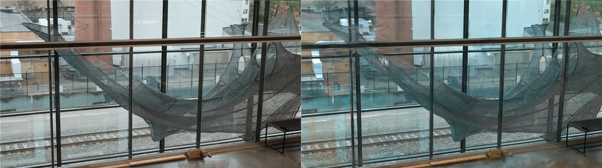
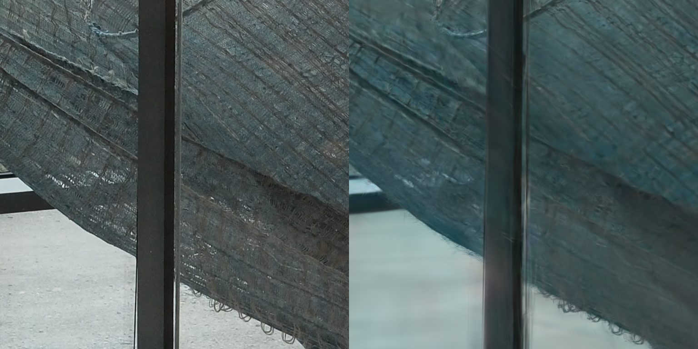
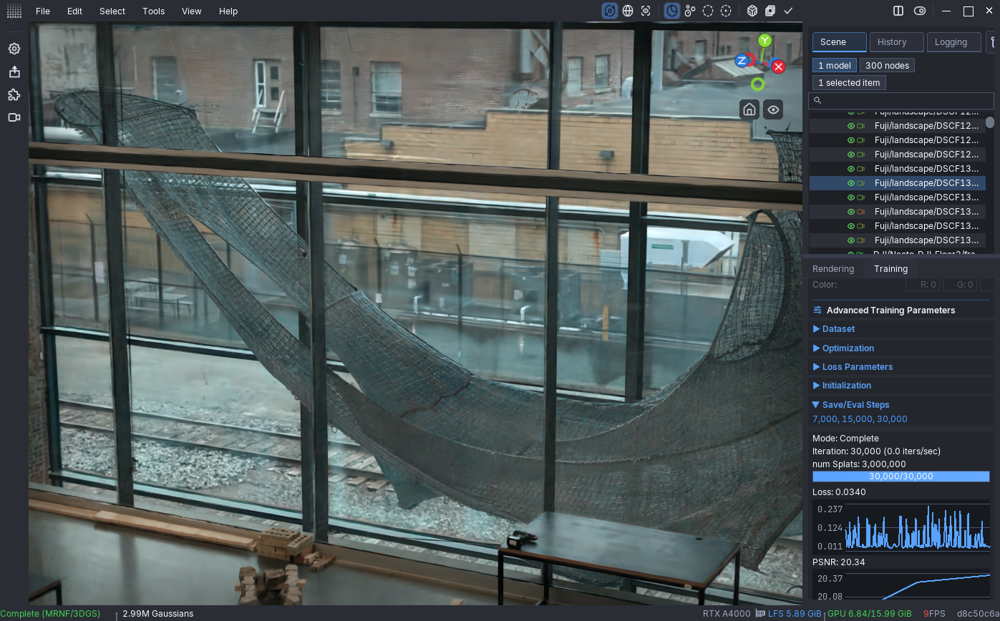
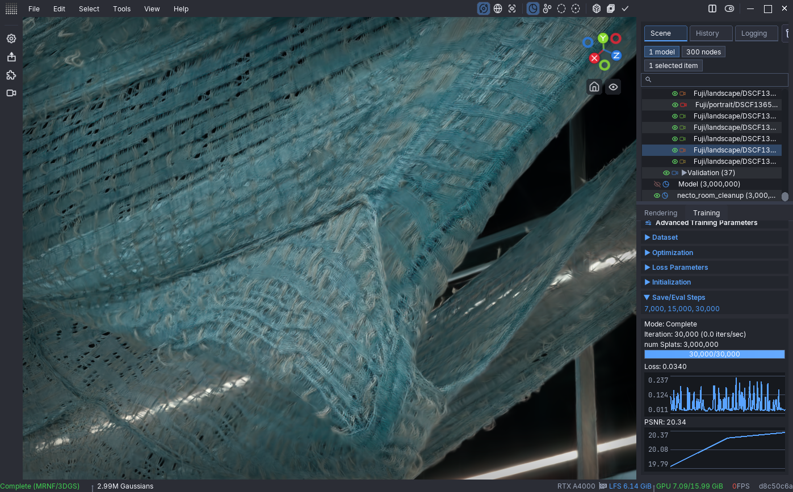
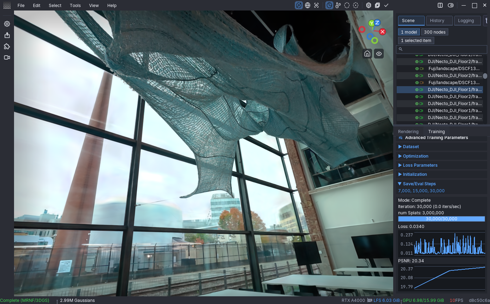

# Necto 001 — multi-camera static reconstruction

Status: reconstruction, native-resolution training, final evaluation and export
complete. Visible LichtFeld training ran from 22:18:28 on 2026-10-04 to
00:32:13 on 2026-10-05, Boston local time: approximately 2 hours 14 minutes,
including evaluations and viewport pauses. All 37 held-out views were evaluated.
The four unregistered photos were excluded as requested.

Pavilion shape, seams and larger weave are recovered. Held-out native Fuji crops
still show softer fine yarn than the photograph and a cooler canonical color.
The completed baseline and those limitations are documented below.

The user confirmed that the suspended knitted pavilion stayed still, with
unchanged shape and lighting, throughout all three camera captures.

| Capture | Images | Native dimensions | Calibration group |
| --- | ---: | --- | --- |
| DJI, floor 1 | 100 | 3840 x 2160 | Separate clip |
| DJI, floor 2 | 70 | 3840 x 2160 | Separate clip |
| Fuji, landscape | 74 | 7728 x 4344 | Fixed XF 33 mm F1.4 |
| Fuji, portrait | 4 | 4344 x 7728 | Same lens, separate orientation |
| iPhone | 50 | 2160 x 3840 | Fixed lens and zoom |

The 298 originals are in `data/static_multi-camera_Necto_001/images`.
`sfm_images` contains hard links to the unchanged originals, grouping Fuji
orientations separately for shared calibration. `input_mapping.json` records
the correspondence. No image was resized or exposure-adjusted. Fuji training
images must retain native resolution. These individually moving cameras do not
form a fixed camera rig.

DJI electronic stabilization was off. iPhone stabilization may have been on;
its registration and residuals need particular attention. Prepared Fuji JPEGs
have no useful lens EXIF; the confirmed 33 mm lens provides a focal estimate.

Visible COLMAP 4.2.1 initially extracted SIFT on GPU 0 at maximum image size
7728, feature target 32768, with OPENCV intrinsics shared per folder. Multiple
keypoint orientations can produce more descriptor rows than the target.
244 landscape images succeeded. GPU allocation failed at a large portrait
image, poisoning the remaining extraction context; the NVIDIA error dialog was
closed and COLMAP restarted. The completed database results are preserved.
The missing 54 images succeeded with CPU SIFT and 8 threads at native
resolution. The database now has 11,219,052 descriptor rows. No Windows restart
or installation change was needed.

Camera initialization is recorded in `calibration_initialization.json`.
Fuji focal estimates use the confirmed 33 mm lens; video focal estimates are
starting values, not measured calibration. Reconstruction must refine and
validate them. Exhaustive guided matching runs on GPU 0, block size 20,
with a 32768-feature matching limit. This bounds GPU memory without resizing
the training images. Images with more descriptors are truncated by the GPU
matcher, as recorded in its log. Initial matching used approximately 13 GiB
of the 16 GiB GPU. Matching finished in 60.755 minutes: all 44,253 image pairs
were attempted, with 8,673 verified pairs having at least 15 inliers. All 298
images belong to one connected component, spanning every calibration group.
See `matching_summary.json`. Connectivity is not a registered 3D reconstruction.

Incremental reconstruction started at approximately 21:17 local time. COLMAP
selected Fuji images #171 and #176 for initialization. Mapper uses 16 CPU
threads, focal-length and distortion refinement, fixed principal points,
local bundle-adjustment maximum 50 iterations and global maximum 100.
Automatic snapshots are written every 50 registered frames under the ignored
dataset folder. Reconstruction completed in 35.163 minutes: 294 registered
images, 553,662 points and 2,373,914 observations. The user approved excluding
the four unregistered Fuji images. All 170 DJI images, 50 iPhone images and
74 Fuji images are registered, including two portrait Fuji photos.

The exported main model is under `data/static_multi-camera_Necto_001/sparse/0`.
See `reconstruction_quality.json` for the native-pixel residual audit. Mean
stored point error is 0.8486 pixels. Observation-weighted mean errors are
0.8310 and 0.8970 for the two DJI groups, 0.9939 for landscape Fuji, 0.6264
for portrait Fuji and 0.8866 for iPhone. No audited observations lie behind
their cameras. These are image alignment errors, not metric geometry accuracy.
The final portrait Fuji focal estimate agrees closely with the landscape
estimate. Bundle adjustment emitted CHOLMOD linear-solver warnings near the
end; subsequent refinement completed and the exported calibration was audited.

Undistortion ran through COLMAP's Dense reconstruction GUI. Its defaults use
no maximum image-size limit and JPEG quality 100. The exported PINHOLE cameras
retain the original focal lengths in pixels: no downsampling scale was applied.
Lens correction changes the border/canvas: landscape Fuji is 7724 x 4341,
portrait Fuji 4333 x 7715, DJI 3815 x 2148 and 3806 x 2145, iPhone 2158 x 3841.
The prepared dataset is `data/static_multi-camera_Necto_001/undistorted`;
its binary model is also copied into `sparse/0` for standard loading.

Completed training used MRNF, SH degree 3, PPISP appearance correction, 30,000 iterations
and a 3,000,000 Gaussian capacity. Full resolution is explicitly passed as
resize factor 1 and maximum width 0; filesystem image cache is disabled.
LichtFeld split the 294 views into 257 training and 37 validation cameras.
The run completed on the RTX A4000 16 GiB without training errors. Sampled
peak total GPU memory use during the monitored run was 9,815 MiB; this is a
sampled system reading, not an exact trainer allocation peak.
The portable settings are in `training_recipe.json`; `training_split.json`
records the actual 257 training and 37 validation images. Validation includes
nine Fuji landscape photos, 22 DJI frames and six iPhone frames. The four
excluded Fuji photos are recorded in `excluded_images.json`.

To view the cleaned model from the project root in PowerShell, use:

```powershell
& .\.local\apps\lichtfeld-v0.5.3\bin\LichtFeld-Studio.exe `
  --view .\outputs\static_multi-camera_Necto_001\run_01\necto_room_clean_01.ply
```

Keep its same-stem `.ppisp` companion beside the PLY. This viewer looks for the
appearance companion automatically. This run learned per-camera PPISP without
a novel-view controller, so free views may use fallback appearance rather than
the color of a particular source camera.

In the GUI, **File -> Import PLY, SOG, SPZ, RAD, USD** opens the PLY. To
restore the original training state and calibrated camera navigation, use
**File -> Import Checkpoint** with `checkpoint_30000.resume`; retain the dataset
in its recorded location. The checkpoint contains the original uncleaned model.

For a separate new training run using the same dataset and recipe:

```powershell
& .\.local\apps\lichtfeld-v0.5.3\bin\LichtFeld-Studio.exe `
  -d .\data\static_multi-camera_Necto_001\undistorted `
  -o .\outputs\static_multi-camera_Necto_001\run_02 `
  --config .\documentation\static_multi-camera_Necto_001\training_recipe.json `
  --resize_factor 1 --max-width 0 --test-every 8 --no-fs-cache
```

The CLI config loader reads optimization settings only, so the explicit
dataset/resolution arguments are required. Click Start Training in the GUI
for a new run; choose an unused output folder and run one trainer at a time.
The dataset and run outputs stay excluded from Git.

Evaluation caveat: the installed `metrics.cpp` compares the canonical raw
Gaussian render with the held-out image without applying learned PPISP.
Cross-camera white balance/exposure differences therefore affect PSNR/SSIM.
Saved side-by-side images and weave detail must also be reviewed; the numeric
scores alone do not measure geometric accuracy or corrected display appearance.

The first evaluation covered all 37 held-out views: PSNR 19.8143 dB,
SSIM 0.7558, three million Gaussians. The checkpoint includes optimizer and
PPISP state and its preserved copy was SHA-256 verified. See
`checkpoint_7000_summary.json` and `training_metrics.csv`. Scheduled saves
before the final iteration write resumable checkpoints; the final iteration
also saves the PLY model and PPISP sidecar.

`18_eval_7000_fuji_overview.png` is a reduced preview of evaluation pair 9.
`19_eval_7000_fuji_native_crop.png` shows matching 768 x 768 crops at original
pixel size: photograph on the left, render on the right. Crop origin in each
7724 x 4341 image is x=3000, y=2300. The early reconstruction follows the
pavilion silhouette and seams, but fine yarn detail is still softer than the
photo and the canonical render has a blue cast.

At 15,000 iterations all 37 validation views were evaluated again: PSNR
20.2560 dB, SSIM 0.7717. The checkpoint is preserved separately as
`outputs/static_multi-camera_Necto_001/run_01/checkpoints/checkpoint_15000.resume`.
The matching Fuji comparisons are `21_eval_15000_fuji_overview.png` and
`22_eval_15000_fuji_native_crop.png`. Evaluation order is shuffled: pair 1 at
15k matches pair 9 at 7k. This was checked by reference-image thumbnail RGB
RMSE (0.0796 on the 0–255 scale, versus 64.53 for the next candidate), recorded
in `evaluation_match_15000.json`. A reused-index crop was corrected before
retaining the comparison. Detail improved modestly; fine fibers remain soft.
Tiled training is not yet verified in the installed trainer and must not be
assumed available solely from UI labels.

Final evaluation of the original trained model:

| Iteration | Held-out PSNR (dB) | Held-out SSIM |
| ---: | ---: | ---: |
| 7,000 | 19.8143 | 0.7558 |
| 15,000 | 20.2560 | 0.7717 |
| 30,000 | 20.3420 | 0.7754 |

30k has the best recorded aggregate scores, with modest improvement after
15k. Scores use the uncorrected canonical render as described above; these
scores were not recalculated after cleanup.

| Artifact | Local path beneath the project root |
| --- | --- |
| Cleaned viewing model | `outputs/static_multi-camera_Necto_001/run_01/necto_room_clean_01.ply` |
| Cleaned model appearance companion | `outputs/static_multi-camera_Necto_001/run_01/necto_room_clean_01.ppisp` |
| Intact original, 744,001,532 bytes | `outputs/static_multi-camera_Necto_001/run_01/splat_30000.ply` |
| Original appearance, 19,703 bytes | `outputs/static_multi-camera_Necto_001/run_01/splat_30000.ppisp` |
| Final original resumable state, 1,230,038,577 bytes | `outputs/static_multi-camera_Necto_001/run_01/checkpoints/checkpoint_30000.resume` |
| Earlier preserved states | `outputs/static_multi-camera_Necto_001/run_01/checkpoints/checkpoint_07000.resume` and `checkpoint_15000.resume` |
| All final held-out comparisons | `outputs/static_multi-camera_Necto_001/run_01/eval_step_30000/` |

`export_verification.json` records PLY length/vertex checks, finite values in
1,024 sampled vertices, checkpoint header/embedded JSON and hash equality with
the latest checkpoint, plus the original companion header and hash.
`training_result.json` records completion and visual review.

The final matched reference is evaluation pair 2, not the earlier pair indices.
`evaluation_match_30000.json` verifies the reference match. The native crop uses
the same coordinates and size as 7k/15k. Photograph is left, raw render right:





Conservative room-preserving cleanup:

The user requested keeping the room and windows. Cleanup was performed in the
visible GUI on a duplicate, with the original hidden and locked. One undoable
pass removed 5,031 exceptionally large, faint Gaussians (maximum activated
scale greater than 1.0 in this reconstruction's units and activated opacity
below 0.1). This is a conservative artifact heuristic, not a semantic detector.
No room crop, global low-opacity pruning or brightness bake was applied.
Thin yarn and suspension cables were protected from broad opacity pruning.
2,994,969 Gaussians remain. Exact source indices are recorded in
`cleanup_large_weak_indices.json`; settings and validation are in
`cleanup_recipe.json` and `cleanup_verification.json`.

Matched GUI before/after pairs use the same calibrated cameras and settings:
40/42 for the overview (Fuji DSCF1300), 43/44 for close weave (Fuji DSCF1345),
45/46 for the room (DJI floor 1 frame 00180). The initial blank candidate
capture was archived locally after restoring the duplicate's render binding.







Training viewpoints show more detailed weave than the held-out crop; they
demonstrate training fit, not unseen-view accuracy. Fine fibers, transparency,
repeated texture and glass/background reflections remain limitations. Cleanup
does not guarantee an artifact-free view from unrecorded angles. Neither the
SfM residuals nor render scores establish physical deformation accuracy.

Actual GUI screenshots are saved here as processing proceeds. Databases,
images, caches and models remain excluded from Git; reports and screenshots
can be committed by the user.

References: [COLMAP camera models](https://colmap.github.io/cameras.html) and
[COLMAP input and reconstruction tutorial](https://colmap.github.io/tutorial.html).
