# Continuous 4D short benchmark

The source intervals are pinned in [the configuration](../../configs/temporal_benchmark_001.json). Both methods use the same calibrated crops, shared initial point cloud, and 75 training / 15 held-out timestamps across all three cameras. Textile includes the hands. This is a local pilot with a shared adapter, not a reproduction of the published evaluations. Models, raw clips, caches and build logs remain ignored.

[Finished video comparison](comparison.html)

## Chronological record

### 001 - Pinned action intervals and isolated native setup

2026-10-09T00:24:53.426056+00:00 / prepared

Yogurt source 330–419; textile 587–676, at 30000/1001 fps. Three calibrated cameras, shared 1280-pixel crops, identical initial XYZ/RGB and held-out timestamps. Official upstream sources are pinned. Existing static tools and earlier reconstructions are untouched.

### 002 - MMCV packaging attempt failed

2026-10-09T00:24:53.619625+00:00 / failed; corrected

MMCV 1.6 metadata generation failed because isolated setuptools 84 no longer supplied pkg_resources. Pinning setuptools 70.3 and installing MMCV without build isolation resolves this packaging issue. WSL was checked and is not installed; native Windows CUDA is being tested first.

[Stage screenshot](002_setup_failure.png)

### 003 - Visual review confirms dragging and stretching

2026-10-09T00:27:49.832820+00:00 / verified inputs

Reviewed all three cameras at the start, one second, two seconds and final selected frame. Yogurt moves across the printed board; textile is folded, stretched and lifted. Extractions contain all 90 native frames without upsampling the earlier 10 Hz images. Full-frame preparation is being narrowed to fixed action regions before fitting to avoid pulling the model toward uninitialized room backgrounds.

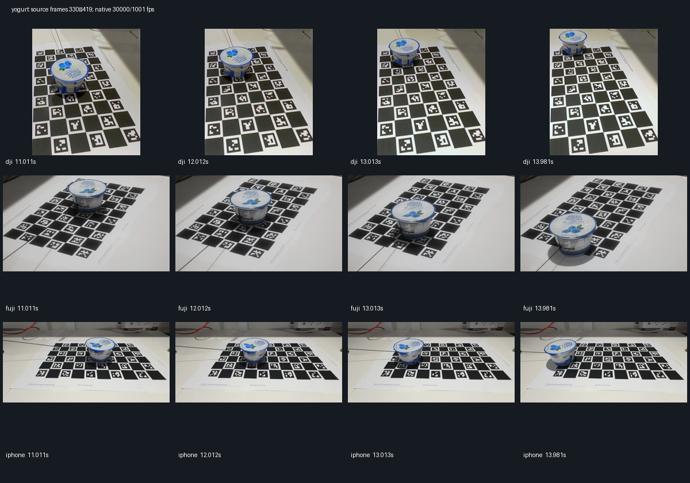
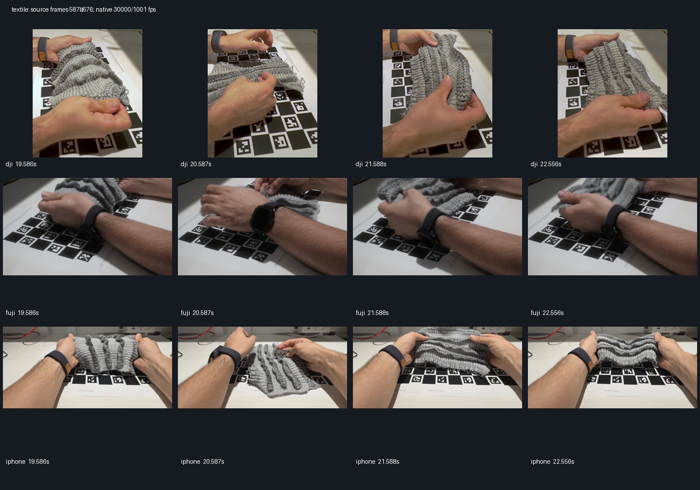

[Stage screenshot](003_input_review.png)

### 004 - CUDA 13 native compiler failure

2026-10-09T00:30:01.539304+00:00 / failed; compatibility patch applied

Both nearest-neighbor and 4DGaussians rasterizer builds rejected the MSVC traditional preprocessor. Added the requested /Zc:preprocessor flag via nvcc for Windows builds. The mathematical CUDA kernels are unchanged. Also corrected an initial PowerShell developer-shell initialization quoting error by using the existing Visual Studio DevShell module. Logs are retained under .local/workflows/temporal_benchmark_001/build.

[Stage screenshot](004_cuda_failure.png)

### 005 - Tensor-binding header compilation failed

2026-10-09T00:34:35.796858+00:00 / failed; corrected includes

With the required CUDA preprocessor enabled, PyTorch 2.9 compiled-autograd headers produced an ambiguous std namespace in NVCC CUDA units. CUDA-only headers now include torch/types.h; ext.cpp retains torch/extension.h and the official Python bindings. Rasterization and nearest-neighbor kernels remain unchanged. The shared pilot adapter uses official Gaussian models, deformation modules and CUDA renderers, with calibrated off-center camera projections and common image losses. This is an adapted local comparison, not a paper leaderboard reproduction.

[Stage screenshot](005_tensor_header_failure.png)

### 006 - All official CUDA extensions compiled

2026-10-09T00:35:50.304241+00:00 / passed native builds

Official simple-knn, 4DGaussians rasterizer and 4C4D rasterizer compile and install successfully with CUDA 13.2/MSVC 14.44/PyTorch 2.9.1 cu130. Each renderer resides in its own child environment. First training smoke attempt found an adapter AABB type mismatch before optimization; fixed by passing the lists expected by the upstream API. No published model kernels were replaced.

[Stage screenshot](006_native_builds.png)

### 007 - 4DGaussians coarse and deformation smoke test passed

2026-10-09T00:38:00.872163+00:00 / passed after adapter corrections

Twenty-five image updates completed on the selected yogurt interval, including the deformation stage and temporal RGB/opacity heads. Analytical camera projections match CUDA clip-space pixel mapping within 0.00007 pixels. Two preliminary adapter attempts failed: wrong AABB input type, then AABB reset onto CPU. Both were corrected, logs retained. Final smoke optimization took 1.44 seconds and allocated at most 0.72 GiB GPU memory; this is compatibility evidence, not reconstruction quality.

[Stage screenshot](007_smoke_4dgaussians.png)

### 008 - 4dgaussians_yogurt_smoke_04 started

2026-10-09T00:41:28.110726+00:00 / training

625 image updates; batch size 1; pinned action interval, common seed/cameras/losses, held-out timestamps and a 180000-point cap. Live progress appears at http://127.0.0.1:8108/.

### 009 - 4dgaussians_yogurt_smoke_04 completed

2026-10-09T00:42:14.176385+00:00 / trained; awaiting visual review

Completed 625 updates in 34.8 seconds; 43498 Gaussians; peak allocated GPU memory 0.77 GiB. Held-out timestamp image PSNR 18.09 dB, full-crop SSIM 0.796. These photometric metrics do not establish novel-view geometry or material-point accuracy.

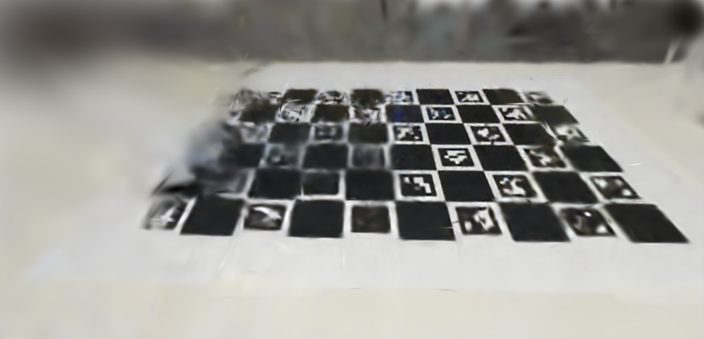
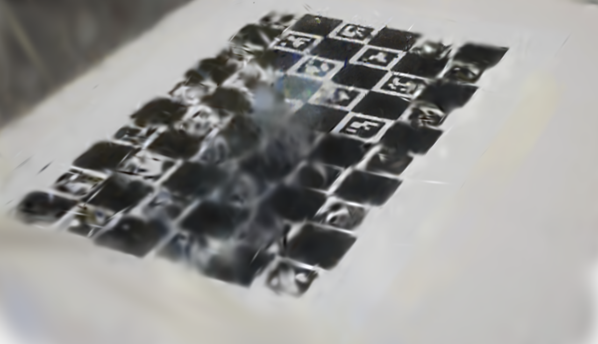
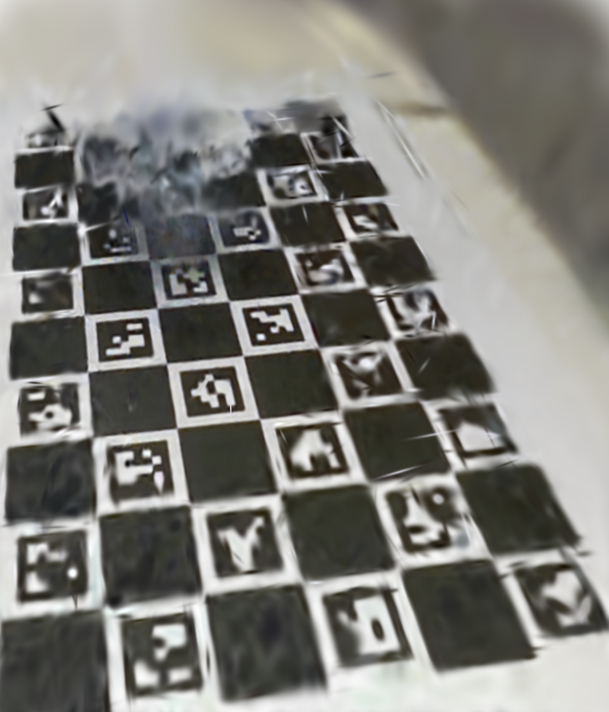

[Stage screenshot](4dgaussians_yogurt_smoke_04_completed.png)

### 010 - 4dgaussians_yogurt_pilot_01 started

2026-10-09T00:43:21.847022+00:00 / training

6000 image updates; batch size 1; pinned action interval, common seed/cameras/losses, held-out timestamps and a 180000-point cap. Live progress appears at http://127.0.0.1:8108/.

### 011 - Textile mask preparation correction

2026-10-09T00:43:37.409255+00:00 / failed initial lookup; corrected

The previous segmentation output actually contains masks at approximately 5 Hz, not every 10 Hz sync-plan index. The first native-mask preparation failed on a missing odd-numbered frame. The corrected preparer selects the nearest available mask and transports it to each current native RGB frame using 2D Farneback image flow. This supplies approximate foreground/hand masks only, not 3D motion supervision. Both methods receive the identical derived masks; optical-flow boundaries remain unverified.

[Stage screenshot](010_mask_preparation_correction.png)
[Stage screenshot](011_yogurt_training_live.png)

### 012 - 4dgaussians_yogurt_pilot_01 completed

2026-10-09T00:52:41.482147+00:00 / trained; awaiting visual review

Completed 6000 updates in 544.8 seconds; 180000 Gaussians; peak allocated GPU memory 2.20 GiB. Held-out timestamp image PSNR 28.19 dB, full-crop SSIM 0.948. These photometric metrics do not establish novel-view geometry or material-point accuracy.

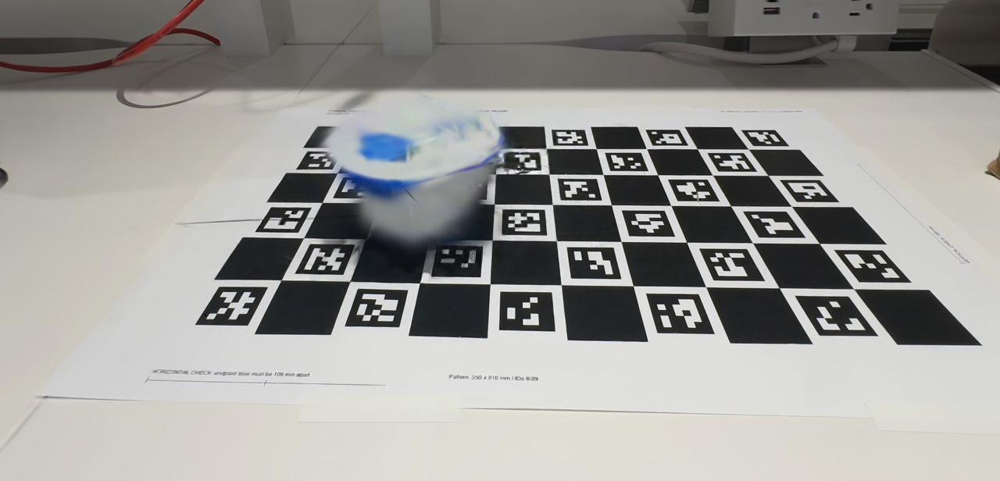
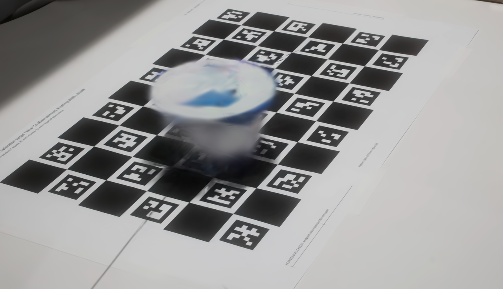
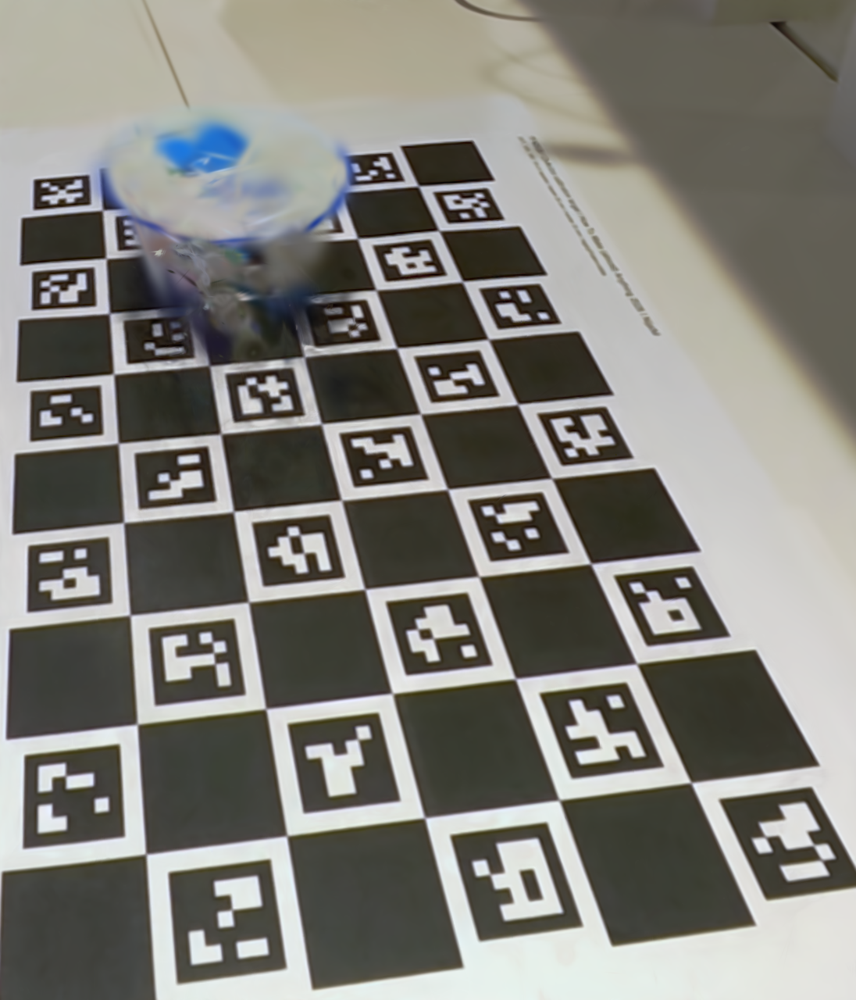

[Stage screenshot](4dgaussians_yogurt_pilot_01_completed.png)

### 013 - 4c4d_yogurt_pilot_01 started

2026-10-09T02:39:01.631029+00:00 / training

6000 image updates; batch size 1; pinned action interval, common seed/cameras/losses, held-out timestamps and a 180000-point cap. Live progress appears at http://127.0.0.1:8108/.

### 014 - User scope update: reconstruct textile hands

2026-10-09T02:40:34.767739+00:00 / protocol revised before textile training

Hands must remain in the reconstruction. Both textile methods will now fit fabric and hands, with equal foreground priority; the hand masks identify foreground rather than excluding pixels. Initial hand geometry will be reconstructed from the first selected synchronized three-camera frame and shared by both methods. The action intervals and train/test frame splits remain unchanged. Yogurt pilot 01 finished: the container is present but soft; its board detail is stronger than its moving-object detail, so overall image scores must not be treated as proof of crisp actor reconstruction.

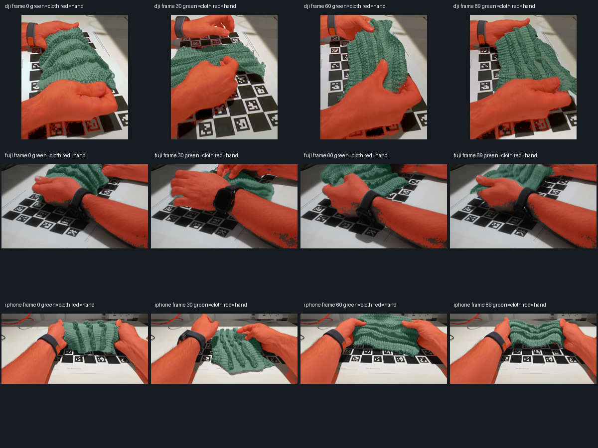

[Stage screenshot](014_include_hands.png)

### 015 - 4c4d_yogurt_pilot_01 completed

2026-10-09T02:44:41.558923+00:00 / trained; awaiting visual review

Completed 6000 updates in 327.6 seconds; 179651 Gaussians; peak allocated GPU memory 1.57 GiB. Held-out timestamp image PSNR 32.16 dB, full-crop SSIM 0.962. These photometric metrics do not establish novel-view geometry or material-point accuracy.

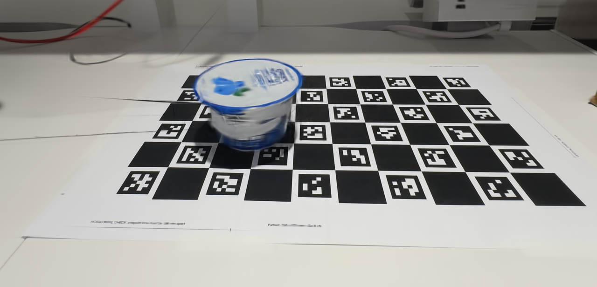

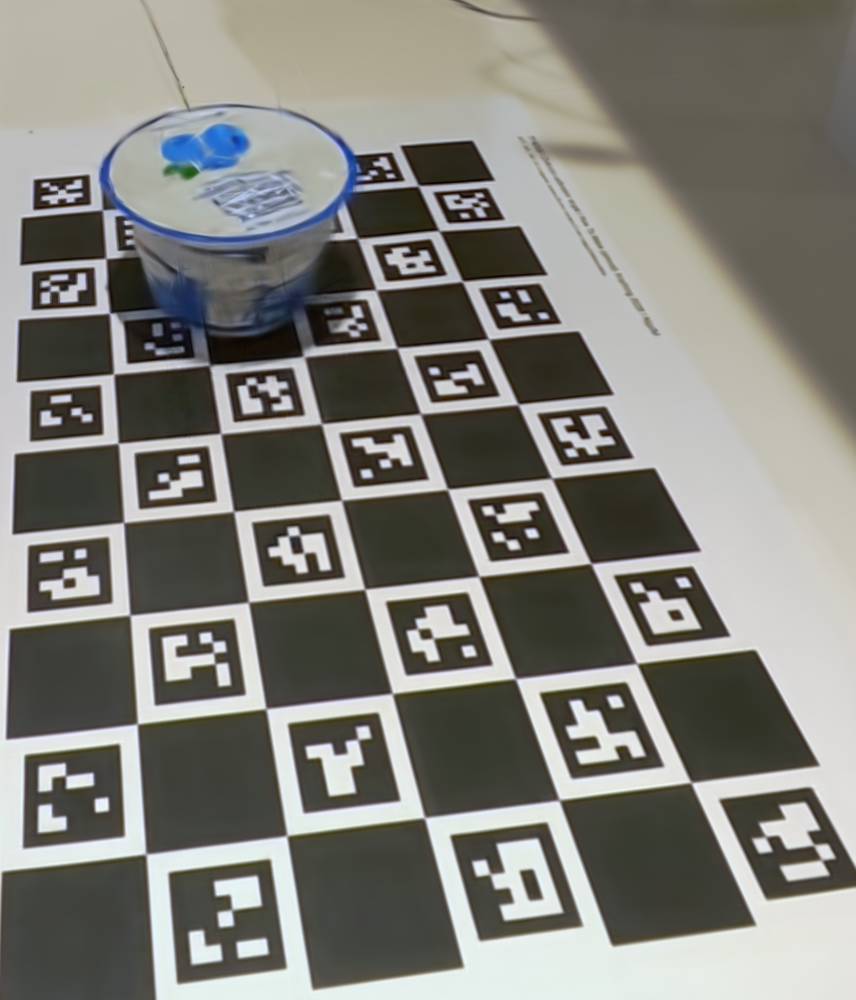

[Stage screenshot](4c4d_yogurt_pilot_01_completed.png)

### 016 - Shared textile and hand initialization reconstructed

2026-10-09T02:50:31.493973+00:00 / prepared and visually inspected

The first selected timestamp was matched across all three calibrated cameras. Combined hand/cloth reconstruction has 793 filtered stereo anchors plus 7930 registered neural-prior samples. These are fused with the same-timestamp detailed cloth seed, then clipped to the common action volume to reject remote prior points. Both methods receive exactly the same resulting cloud and RGB targets. Neural-prior depths, repeated-knit matches and off-board calibration remain unverified.

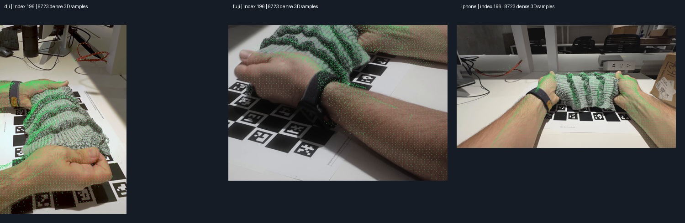

### 017 - 4dgaussians_textile_smoke_hands_01 started

2026-10-09T02:50:31.740338+00:00 / training

625 image updates; batch size 1; pinned action interval, common seed/cameras/losses, held-out timestamps and a 180000-point cap. Live progress appears at http://127.0.0.1:8108/.

### 018 - 4dgaussians_textile_smoke_hands_01 completed

2026-10-09T02:51:28.901219+00:00 / trained; awaiting visual review

Completed 625 updates in 40.3 seconds; 36228 Gaussians; peak allocated GPU memory 0.75 GiB. Held-out timestamp image PSNR 16.19 dB, full-crop SSIM 0.709. These photometric metrics do not establish novel-view geometry or material-point accuracy.

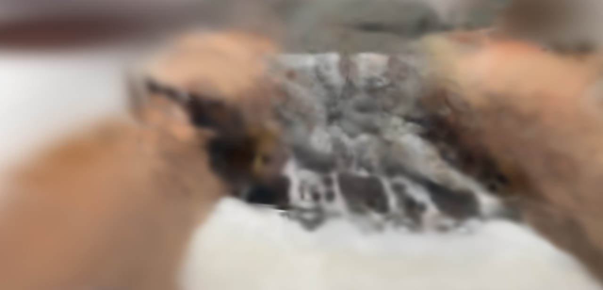
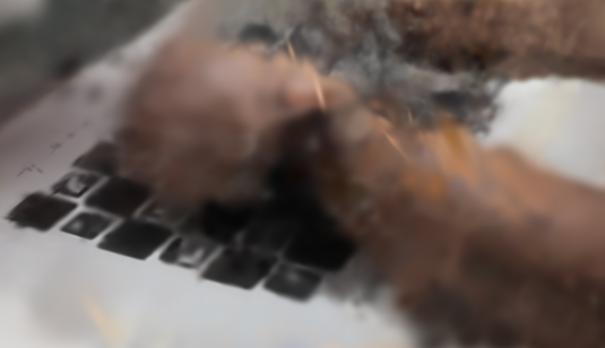
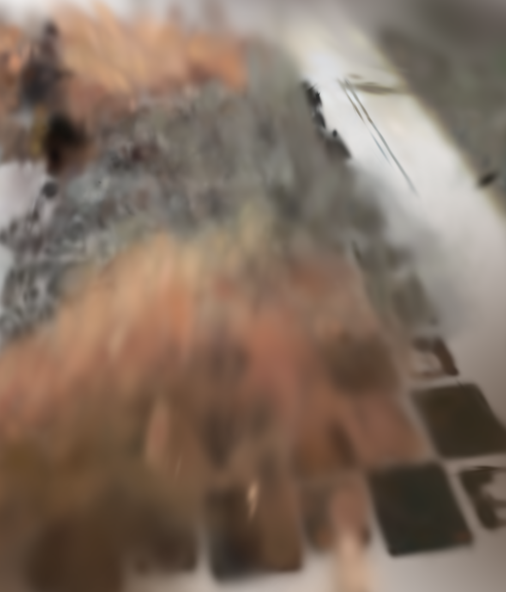

[Stage screenshot](017_hand_smoke_headless.png)

### 019 - 4c4d_textile_smoke_hands_01 started

2026-10-09T02:54:38.507415+00:00 / training

625 image updates; batch size 1; pinned action interval, common seed/cameras/losses, held-out timestamps and a 180000-point cap. Live progress appears at http://127.0.0.1:8108/.

### 020 - 4c4d_textile_smoke_hands_01 completed

2026-10-09T02:55:21.055735+00:00 / trained; awaiting visual review

Completed 625 updates in 28.8 seconds; 36660 Gaussians; peak allocated GPU memory 0.59 GiB. Held-out timestamp image PSNR 17.03 dB, full-crop SSIM 0.719. These photometric metrics do not establish novel-view geometry or material-point accuracy.

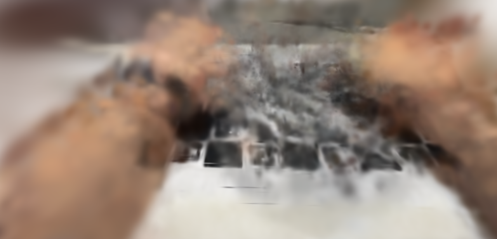
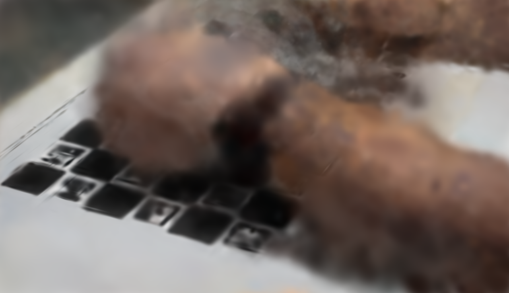
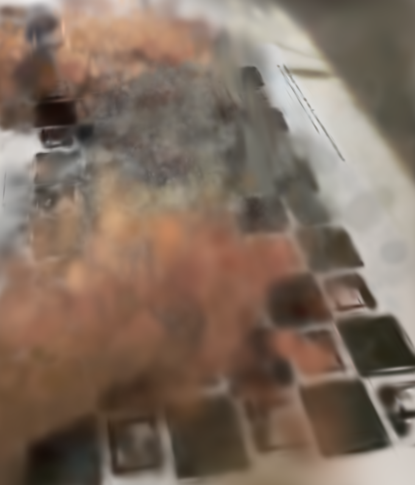

[Stage screenshot](4c4d_textile_smoke_hands_01_completed.png)

### 021 - 4dgaussians_textile_pilot_01 started

2026-10-09T02:55:50.001555+00:00 / training

6000 image updates; batch size 1; pinned action interval, common seed/cameras/losses, held-out timestamps and a 180000-point cap. Live progress appears at http://127.0.0.1:8108/.

### 022 - All four temporal smoke combinations passed

2026-10-09T02:56:02.893732+00:00 / passed model and gradient checks

Both methods completed their short forward/backward, temporal, opacity-decay and densification checks on the pinned action intervals. Textile smoke tests include fabric, hands and their shared first-frame initialization. The visible report browser sometimes paused animation-frame callbacks when inactive, causing screenshot timeouts; this was a documentation failure, not a failed training job. An isolated headless report browser now captures the same local report reliably, and capture failures are recorded independently of completed models.

[Stage screenshot](021_all_smokes_passed.png)
[Stage screenshot](022_textile_training_live.png)

### 023 - 4dgaussians_textile_pilot_01 completed

2026-10-09T03:03:39.154809+00:00 / trained; awaiting visual review

Completed 6000 updates in 453.4 seconds; 88647 Gaussians; peak allocated GPU memory 1.36 GiB. Held-out timestamp image PSNR 22.94 dB, full-crop SSIM 0.814. These photometric metrics do not establish novel-view geometry or material-point accuracy.

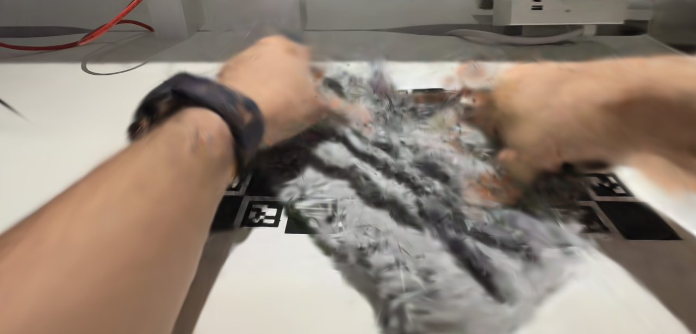
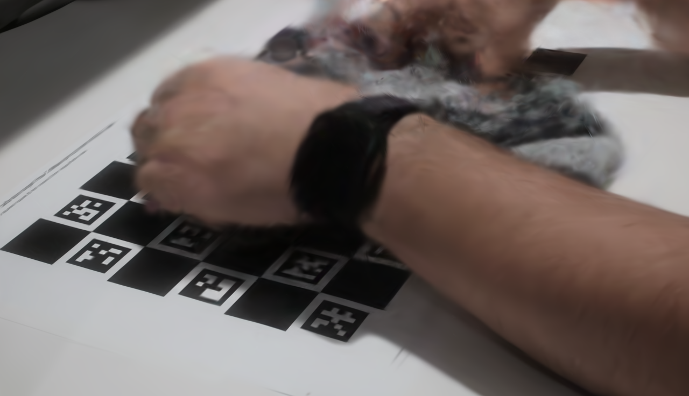
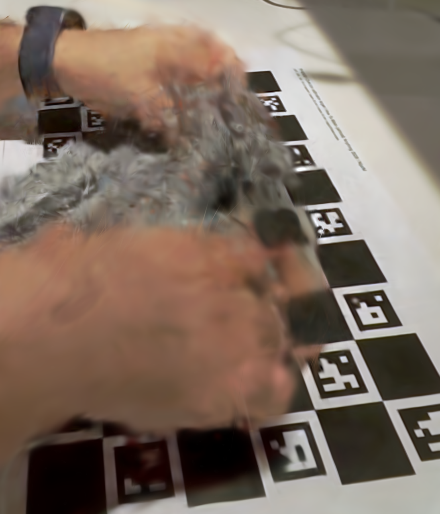

[Stage screenshot](4dgaussians_textile_pilot_01_completed.png)

### 024 - 4c4d_textile_pilot_01 started

2026-10-09T03:03:40.709753+00:00 / training

6000 image updates; batch size 1; pinned action interval, common seed/cameras/losses, held-out timestamps and a 180000-point cap. Live progress appears at http://127.0.0.1:8108/.

[Stage screenshot](023_textile_training_temporal.png)

### 025 - 4c4d_textile_pilot_01 completed

2026-10-09T03:09:46.124893+00:00 / trained; awaiting visual review

Completed 6000 updates in 351.8 seconds; 180000 Gaussians; peak allocated GPU memory 1.54 GiB. Held-out timestamp image PSNR 24.35 dB, full-crop SSIM 0.826. These photometric metrics do not establish novel-view geometry or material-point accuracy.

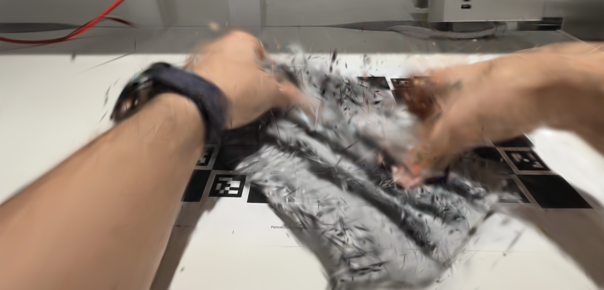
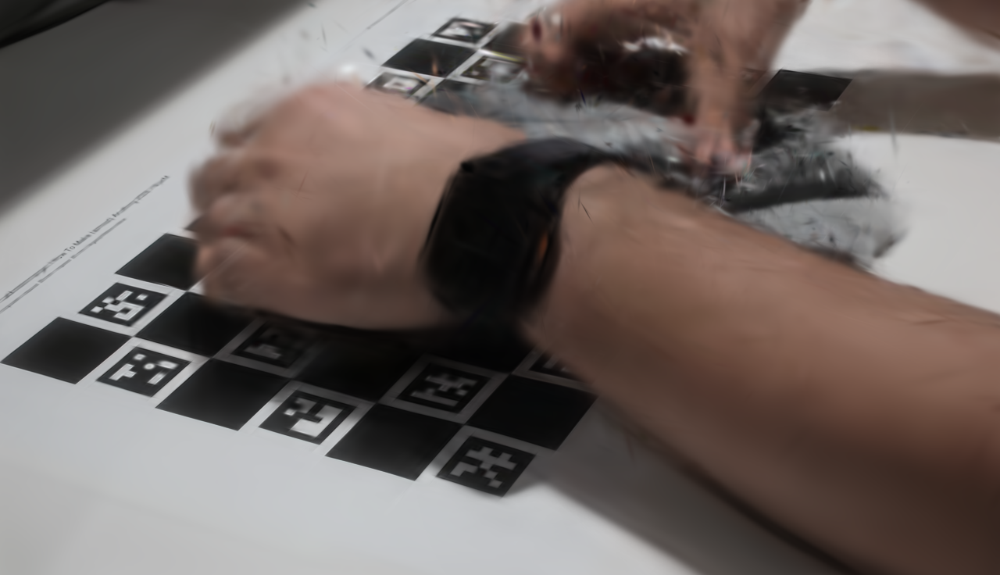
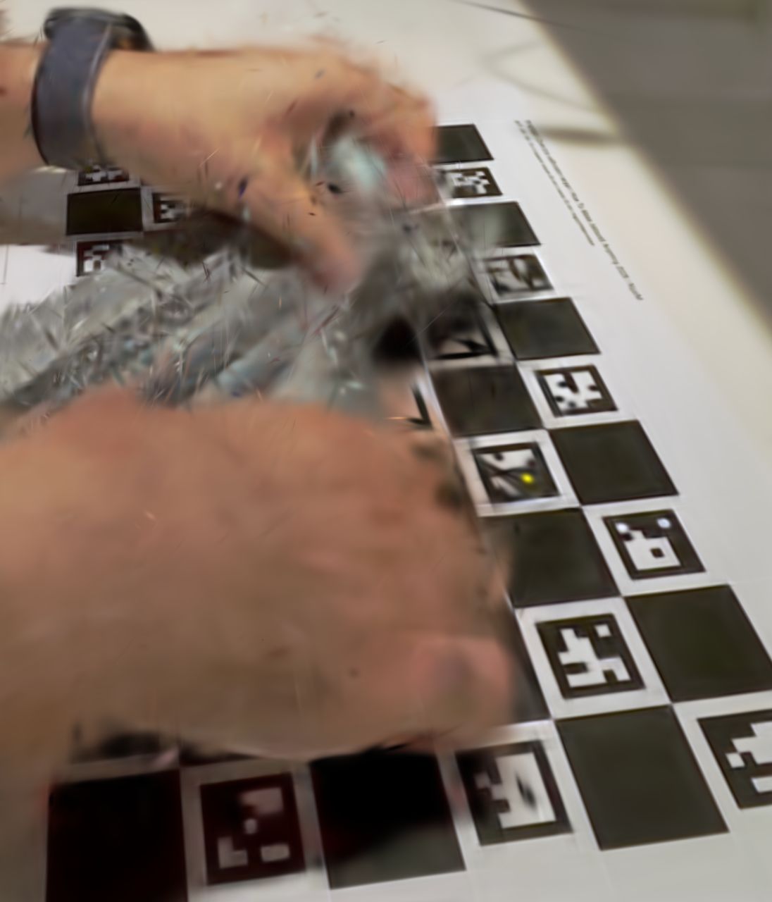

[Stage screenshot](4c4d_textile_pilot_01_completed.png)

### 026 - Live report refresh corrected

2026-10-09T03:11:34.397364+00:00 / corrected

A label cleanup accidentally changed JavaScript query and conditional punctuation. The live panel is now corrected explicitly; all training and saved metrics were unaffected. Browser evidence remains chronological.

[Stage screenshot](027_report_refresh_corrected.png)

### 027 - Video export attempt failed; Windows JSON encoding corrected

2026-10-09T03:15:01.077903+00:00 / export failed; corrected before retry

The first export stopped while reading the BOM-prefixed static-tools.json. The repeated attempt exposed the full traceback; no model training failed and no videos were written. The exporter and independent decoder now read UTF-8 with optional BOM, and encoders terminate on failure. Original checkpoints and attempt logs are retained.

[Stage screenshot](028_export_failure_corrected.png)

### 028 - Four continuous models exported and independently decoded

2026-10-09T03:19:56.470018+00:00 / export and video validation passed

All four single-model inference exports reproduce their held-out training render byte-for-byte in the independent decoder. Direct half-frame queries and 90-frame exact-30-fps orbit encodes passed. All 16 MP4s fully decode with correct frame counts and constant timestamps; seekable HTTP byte ranges match local bytes. The four learned model files remain ignored under outputs. Source comparisons preserve native 29.97 fps.

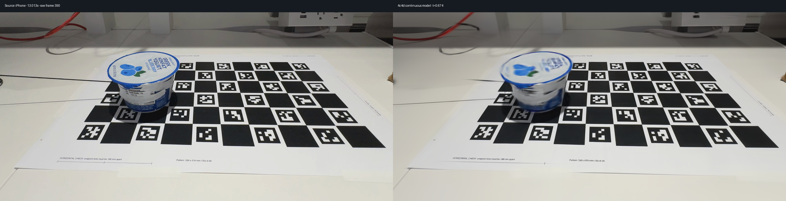
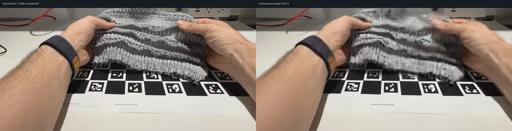

[Video](4c4d_yogurt_pilot_01_rgb_fixed.mp4)
[Video](4c4d_textile_pilot_01_rgb_fixed.mp4)

[Stage screenshot](029_continuous_export_validation.png)

### 029 - Visual review: stronger 4C4D appearance, textile quality target not met

2026-10-09T03:21:32.762461+00:00 / reviewed; not final-quality reconstruction

Source comparisons show sharper yogurt shape and label with 4C4D, although both remain softer than source. Textile hands and arms are reconstructed in both models, but knitted detail is blurred, smeared and ghosted. The +/-45-degree orbit exposes severe view-dependent color and geometry failures in 4DGaussians and unresolved cloth/hand geometry in 4C4D. Higher image scores do not establish correct motion, hidden surfaces or physical measurements. Keep these pilots as evidence; do not replace the earlier selected demos with them or label the textile pristine.

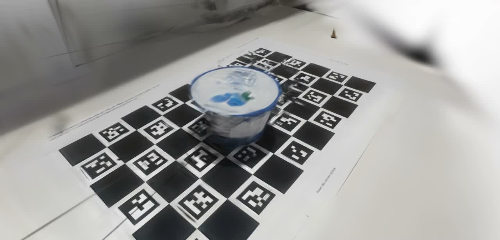
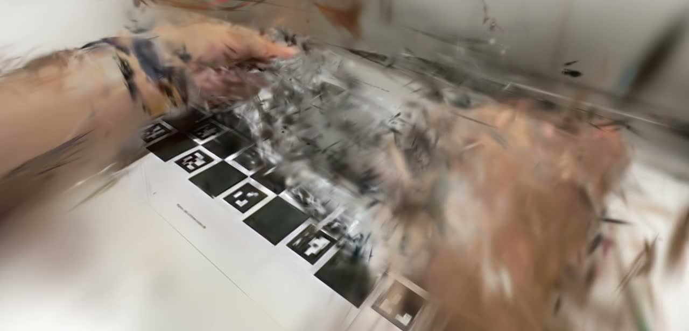
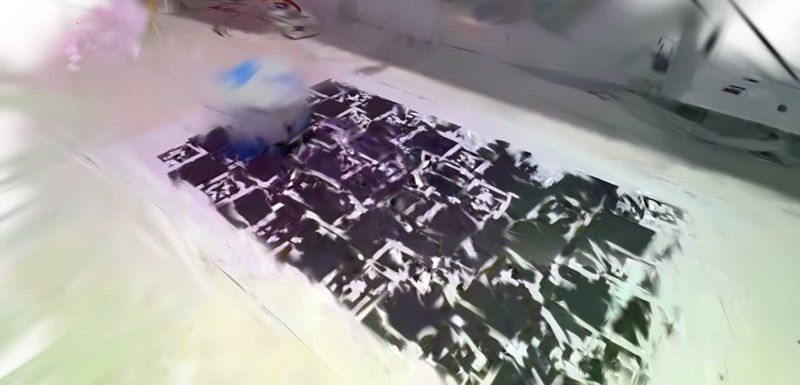
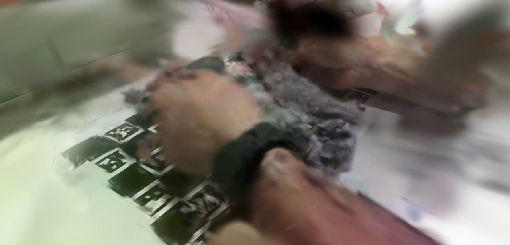

[Stage screenshot](030_visual_quality_review.png)

### 030 - Browser playback sample failed at source-comparison startup

2026-10-09T03:22:08.112482+00:00 / browser startup playback failed; evidence retained

The first headless playback sample showed two dropped browser frames for each 2560-pixel source-comparison video immediately after switching files. Fixed-view and orbit samples had zero drops and advanced normally. All encoded videos already passed full decode and exact cadence checks. Actual failed browser state and screenshot are retained. The next playback sample allows a short startup warmup before measuring steady playback; this does not alter the videos.

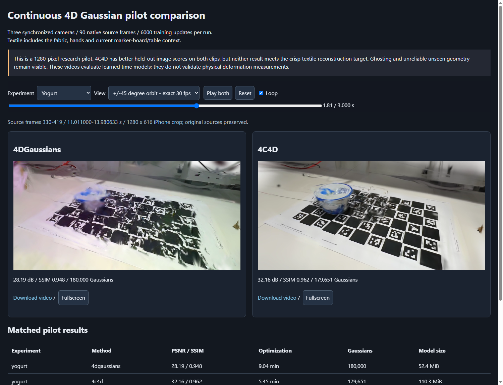

### 031 - Browser callback sample failed; offscreen presentation isolated

2026-10-09T03:23:11.860768+00:00 / presentation sample failed; evidence retained

After startup warmup all six yogurt samples decoded 33-34 frames with zero reported drops, but one video delivered only 23 presentation callbacks. Simultaneous stacked source comparisons place one video outside the viewport; callbacks do not count decoded frames reliably there. The actual second failed sample is saved. Validation will measure each video individually in view, keeping the original zero-drop and callback thresholds.

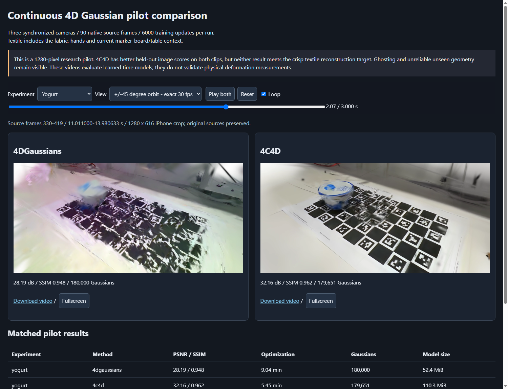

### 032 - Comparison UI and smooth video playback verified

2026-10-09T03:28:16.408507+00:00 / short pilot task complete; textile quality unresolved

Both datasets passed all six per-method browser playback samples, with 32-34 presented frames in each 1.1-second in-view sample and zero reported drops after warmup. Fixed-view, source-comparison and exact-30-fps orbit modes seek and play. A visible dedicated Edge window now shows the textile comparison, including hands. The standalone model decoder and compact MP4 evidence are retained, with source intervals and candid visual limits in RESULTS.md. Working static applications, earlier demos, raw recordings and Git state are preserved. Pair play/pause, synchronized scrub and reset controls were also checked; actual UI state is preserved in 035_ui_controls_verified.capture.json.

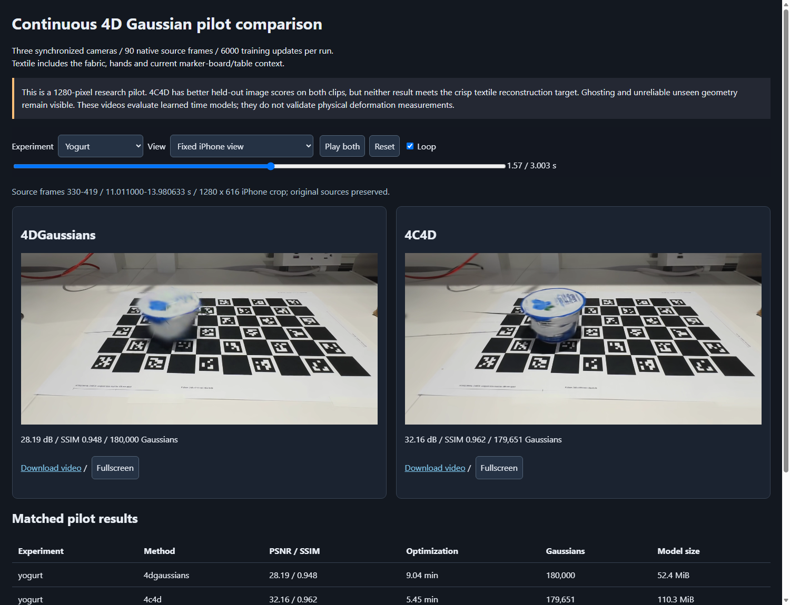
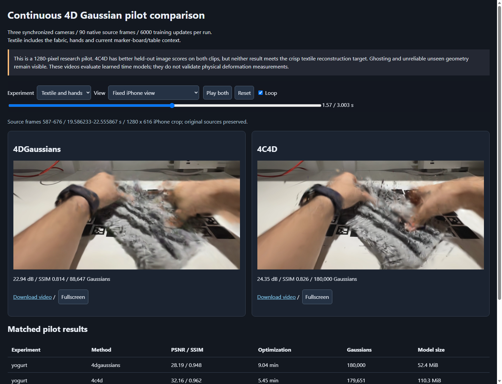

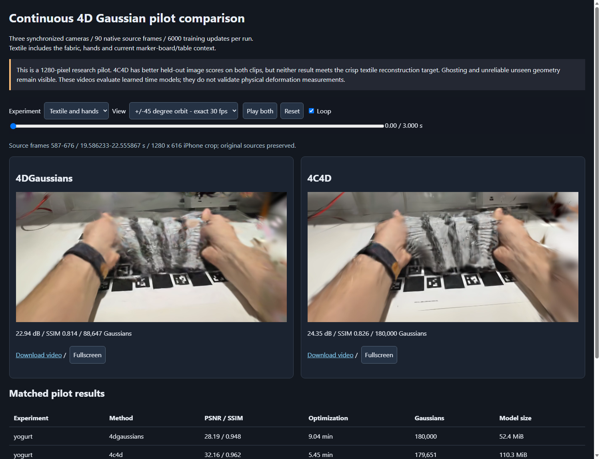

[Stage screenshot](034_final_pilot_checkpoint.png)
